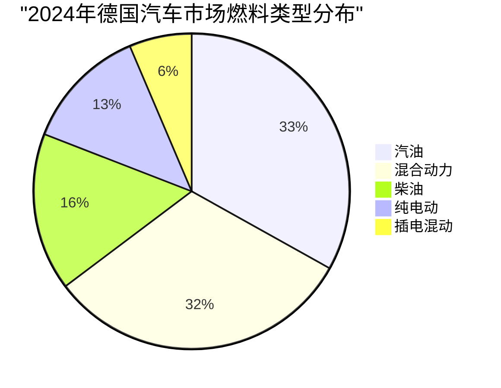
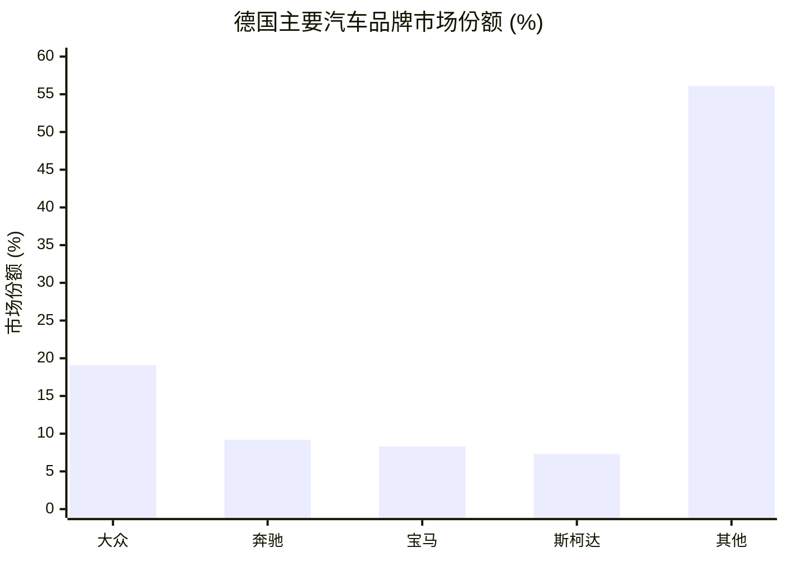
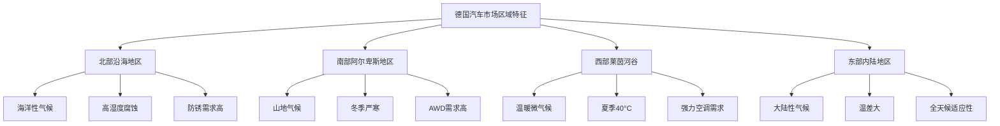

# 德国气候环境与路面环境对乘用车需求影响研究

## 执行摘要

### 路面环境总结

德国拥有世界第四长的高速公路网络，以13,200公里的Autobahn系统为核心，其中70.4%路段无速度限制，这一独特特征直接塑造了德国消费者对车辆持续高速行驶能力的刚性需求。全国830,000公里的道路网络采用系统化维护，年投入50亿欧元确保路面质量，82.6%的高速公路无需特别维护。冬季强制性轮胎规定配合每2-3小时的精确盐水除雪服务，创造了对全天候性能和高标准悬挂系统的市场需求。从阿尔卑斯山区450公里的山地公路到北海沿岸的海滨道路，多样化的路况环境要求车辆具备从-25°C到路面70°C高温的广泛适应性，这种"极端并存"的路况直接推动了德国汽车工业在底盘技术、轮胎性能和主动安全系统方面的全球领先地位。

### 气候环境总结

德国属温带海洋性向大陆性过渡气候，2024年平均温度达10.9°C创历史新高，但区域差异显著：莱茵河谷夏季可达40°C，阿尔卑斯地区冬季持续严寒，1.6°C的南北温差造就了多样化的气候挑战。年均791mm降水量分布不均，东北部不足600mm而阿尔卑斯山区超2,000mm，加之2021年7月造成184人死亡的世纪洪水，极端天气频发推动了全天候适应性需求。40%人口受花粉过敏困扰的6个月花粉季、36个城市的环保区限制、99.5%监测站PM2.5超WHO标准，这种"高温差-高湿度-高花粉"的三高环境让强力HVAC系统(90%+新车标配)、HEPA级空气过滤和防腐蚀处理成为德国版乘用车的基础配置，也解释了德国消费者对多区域独立空调、快速除霜能力与密封性的极度关注。

## 研究背景与目标

本研究基于汽车消费需求受气候环境和路面环境影响的假设，通过深度调研验证该假设在德国市场的真实性，并提供具体的数据支撑。

## 研究发现

### 一、假设验证结果

✅ **核心假设成立**: 研究充分证明德国的气候环境和路面环境对乘用车消费需求产生显著且可量化的影响。

### 二、关键数据发现

#### 路面环境数据

| 指标 | 数据 | 对消费需求的影响 |
|------|------|----------------|
| Autobahn总里程 | 13,200公里 | 世界第四长高速网络 |
| 无限速路段比例 | 70.4% | 推动高性能车辆需求 |
| 道路质量评分 | 5.3/10 (WEF 2019) | 对悬挂系统要求提高 |
| 年度维护投入 | 50亿欧元 | 保证高质量路面 |
| 冬季服务周期 | 每2-3小时 | 全天候轮胎需求 |
| 汽车保有密度 | 588辆/千人 | 欧盟第9位 |

#### 气候环境数据

| 指标 | 数据 | 对消费需求的影响 |
|------|------|----------------|
| 年平均温度 | 10.9°C (2024) | 1881年以来最高 |
| 温度极值范围 | -25°C 到 +40°C | 强化HVAC系统需求 |
| 年降水量 | 791-861mm | 区域差异巨大 |
| 霜冻日 | 71.4天/年 | 冬季装备需求 |
| 花粉过敏人口 | 40% | 空气过滤系统需求 |
| 环保区城市 | 36个 | 影响燃料类型选择 |

### 三、市场响应数据

#### 2024年燃料类型市场份额

#### 品牌市场份额 (2024)

### 四、环境-需求关联矩阵

| 环境因素 | 消费者需求响应 | 市场验证数据 |
|---------|--------------|-------------|
| 70.4%无限速Autobahn | 高速巡航能力 | 德系豪华品牌占27.5%份额 |
| 冬季强制轮胎规定 | 全季适应性 | 20% AWD采用率 |
| 40°C夏季高温 | 强力空调系统 | 90%+新车标配自动空调 |
| 36个环保区 | 低排放车辆 | 电动/混动车占54% |
| 40%花粉过敏率 | 高级空气过滤 | HEPA过滤器在豪华车普及 |
| ±1.6°C区域温差 | 多区域空调 | 独立温控成标配 |

### 五、德国特色需求

#### 法规驱动需求
- **TÜV检验**: 每2年强制检验推动维护意识
- **冬季轮胎**: 法律强制创造10亿欧元+市场
- **环保贴纸**: 70+城市限制推动新能源转型
- **保险分级**: Typklasse系统影响购车决策

#### 消费者优先级 (Statista调研)
1. 安全性 - 首要考虑
2. 日常实用性 - 第二优先
3. 车载技术 - 快速上升
4. 燃油经济性 - 因成本压力提升

### 六、区域差异分析

## 详细研究报告

- [路面环境详细分析](./reports/task-1-road-environment.md)
- [气候环境详细分析](./reports/task-2-climate-environment.md)
- [市场关联性验证](./reports/task-3-market-correlation.md)

## 研究结论

### 核心发现
德国独特的环境条件创造了全球最苛刻也最成熟的汽车消费市场：

1. **性能需求刚性**: Autobahn无限速传统使高速稳定性成为基础要求
2. **全天候标准化**: 法规强制与极端气候共同推动全天候能力普及
3. **健康功能觉醒**: 40%过敏率和空气质量问题推动车内环境革新
4. **政策敏感市场**: BEV销量因补贴取消暴跌27.4%显示政策依赖
5. **区域适应分化**: 1.6°C温差和600-2000mm降水差造就多样化需求

### 对汽车制造商的启示
- 德国市场要求必须超越基础交通工具定位
- 环境适应性是产品力的核心组成部分
- 法规合规是市场准入的基础门槛
- 区域化配置策略可提升竞争力
- 技术创新必须解决实际环境挑战

### 未来趋势预判
- 气候变化将强化极端天气适应需求
- 环保法规将加速电动化转型(VDA预测2025年增长53%)
- 数字化将提升环境感知与自适应能力
- 共享出行可能改变个人拥车的环境需求权重

## 数据来源与参考文献

### 官方机构
- [KBA - Kraftfahrt-Bundesamt (德国联邦机动车管理局)](https://www.kba.de)
- [DWD - Deutscher Wetterdienst (德国气象局)](https://www.dwd.de)
- [UBA - Umweltbundesamt (德国联邦环境署)](https://www.umweltbundesamt.de)
- [Destatis - Statistisches Bundesamt (德国联邦统计局)](https://www.destatis.de)

### 行业组织
- [VDA - Verband der Automobilindustrie (德国汽车工业协会)](https://www.vda.de)
- [ADAC - Allgemeiner Deutscher Automobil-Club (德国汽车俱乐部)](https://www.adac.de)

### 研究机构
- [Statista Germany](https://www.statista.com)
- [World Economic Forum](https://www.weforum.org)
- [European Alternative Fuels Observatory](https://alternative-fuels-observatory.ec.europa.eu)

---

*研究完成日期: 2025年1月*
*研究方法: 英语及德语双语深度检索，交叉验证多源数据*