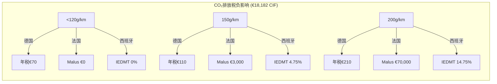
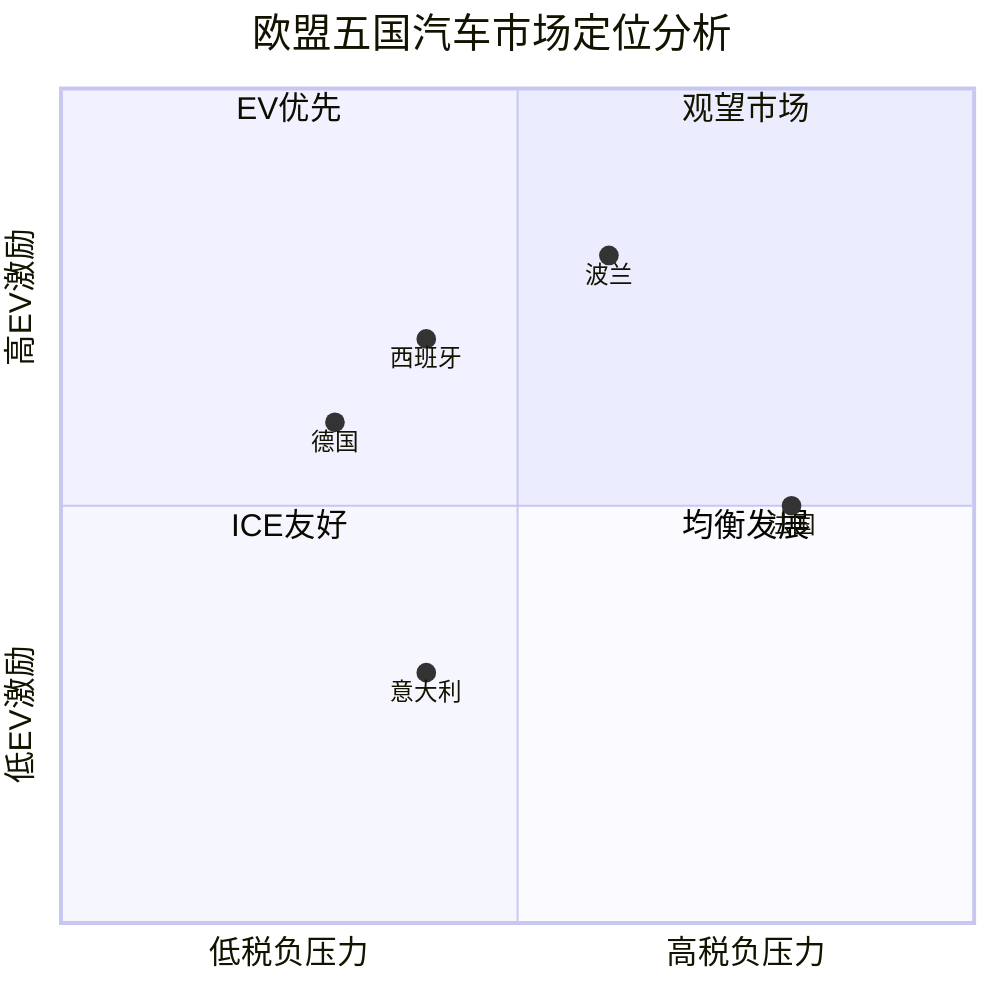

# 欧盟五国乘用车税费综合研究报告

**研究范围：** 德国、法国、意大利、西班牙、波兰
**时间戳：** 2025-01-23 UTC
**汇率基准：** ECB 2025-01-22: 1 EUR = 7.70 CNY

## 执行摘要（Executive Summary）

本研究深入分析欧盟五国乘用车从进口到上牌的完整税负结构，重点关注CIF→OTR（到岸价→上牌价）税负构成及电动化转型政策。研究发现：

1. **税负水平差异巨大**：法国因Malus系统税负最重（高排放车OTR可增200%），波兰消费税对大排量惩罚严厉（18.6%），其他三国相对温和
2. **电动化政策分化**：德国终止直接补贴转向税收优惠，法国维持奖惩并举，意大利中央激励终止依赖地方，西班牙MOVES III延续，波兰新推NaszEauto但排除企业
3. **2025-2026趋势**：整体收紧态势，CO₂门槛持续下降，BEV优惠逐步退坡，重心从消费补贴转向企业激励

## 一、税负结构对比分析

### 1.1 进口环节税负（Import Stage）

| 国家 | 关税率 | 特殊附加 | 中国EV额外关税 | 环境费用 |
|------|--------|----------|-----------------|----------|
| 德国 | EU标准10% | 无 | 适用EU统一政策 | 无 |
| 法国 | EU标准10% | 无 | BYD +17% Geely +18.8% SAIC +35.3% | 港口费 |
| 意大利 | EU标准10% | 无 | 合作方+20.7% 非合作+35.3% | 港口费 |
| 西班牙 | EU标准10% | 无 | 适用EU统一政策 | 无 |
| 波兰 | EU标准10% | CKD/SKD: 4.5% | 适用EU统一政策 | 空气排放费 |

### 1.2 购置环节税负（Purchase Stage）

| 国家 | VAT/IVA | 注册税/消费税 | 特色税种 | BEV优惠 |
|------|---------|---------------|----------|----------|
| **德国** | 19% | 无购置税 年度Kfz-Steuer | CO₂分级年税 | 免税至2030年 |
| **法国** | 20% | Malus €50-70,000 | 重量税€10-30/kg | 免Malus |
| **意大利** | 22% | IPT省级差异 | Superbollo >185kW | 多省IPT免征 |
| **西班牙** | 21% 加那利7-15% | IEDMT 0-14.75% | IVTM市政税 | IEDMT全免 |
| **波兰** | 23% | Akcyza 3.1-18.6% | PCC 2%(私人) | Akcyza免征至2029 |

## 二、CIF→OTR价格瀑布对比

### 2.1 ICE车型案例（CIF: CNY 140,000）

| 国家 | 关税 | 消费/注册税 | VAT | 其他费用 | OTR (CNY) | 增幅 |
|------|------|-------------|-----|----------|-----------|------|
| 德国 | 14,000 | 0 | 29,260 | 770(年税) | 183,260 | +31% |
| 法国 | 14,000 | 46,200(Malus) | 40,040 | 3,080 | **243,320** | **+74%** |
| 意大利 | 14,000 | 2,310(IPT) | 33,880 | 3,080 | 193,270 | +38% |
| 西班牙 | 14,000 | 6,653(IEDMT) | 33,734 | 770 | 195,157 | +39% |
| 波兰 | 14,000 | 26,040(Akcyza) | 41,409 | 457 | 221,906 | +59% |

### 2.2 BEV车型案例（CIF: CNY 196,000）

| 国家 | 基础OTR | 补贴/激励 | 净OTR (CNY) | vs ICE节省 |
|------|---------|-----------|-------------|------------|
| 德国 | 256,564 | 0(已终止) | 256,564 | -40% |
| 法国 | 259,875 | -30,800 | 229,075 | -6% |
| 意大利 | 264,957 | -46,200(2024) | 218,757* | +13% |
| 西班牙 | 261,646 | -53,900 | 207,746 | +6% |
| 波兰 | 265,645 | -71,428 | 194,217 | -12% |

*意大利2025年无国家补贴，显示为2024年参考

## 三、电动化激励政策对比

### 3.1 购置补贴（2025年状态）

| 国家 | 个人补贴 | 企业补贴 | 预算规模 | 特殊条件 |
|------|---------|----------|----------|----------|
| 德国 | 终止 | 终止 | 0 | 转向税收优惠 |
| 法国 | €2,000-4,000 | 无 | €10亿 | 收入联动 |
| 意大利 | 地方差异 | 地方差异 | 无中央预算 | 南蒂罗尔€4,000 |
| 西班牙 | €7,000 | €9,000(商用车) | €17.35亿 | MOVES III |
| 波兰 | PLN 40,000 | 不符合资格 | €3.8亿 | NaszEauto |

### 3.2 持有环节优惠

| 国家 | 流通税/年税 | 公司车BIK | 其他优惠 |
|------|------------|-----------|----------|
| 德国 | 免税至2030(2025前注册) | 0.25%(≤€95,000) | 40%首年折旧 |
| 法国 | 按功率征收 | 50%减免(€1,800上限) | 社会租赁<€200/月 |
| 意大利 | 5年免征+75%减 | 10%应税价值 | 永久免征(部分地区) |
| 西班牙 | IVTM减75% | 30%减免(≤€40,000) | 充电设施双倍折旧 |
| 波兰 | 标准征收 | VAT全额抵扣 | 公交专道至2026 |

## 四、风险与变更监测（2025-2026）

### 4.1 确定性变更

| 时间 | 国家 | 变更事项 | 影响 |
|------|------|----------|------|
| 2025-03-01 | 法国 | CO₂门槛降至113g/km | 90%汽油车触发Malus |
| 2025-12-31 | 西班牙 | MOVES III到期 | 需关注MOVES IV |
| 2025-12-31 | 德国 | 低排放优惠终止 | 小幅增加成本 |
| 2026-01-01 | 德国 | 新BEV立即征税50% | BEV年税€100-200 |
| 2026-01-01 | 法国 | 重量税降至1,500kg | 影响70% SUV |

### 4.2 政策趋势

1. **补贴退坡**：德国已终止，意大利中央终止，其他国家预算缩减
2. **门槛收紧**：CO₂免税门槛持续下降，2027年法国降至98g/km
3. **企业转向**：从个人补贴转向企业车队激励
4. **地方分化**：中央政策退出，地方差异化加大

## 五、市场进入策略建议

### 5.1 国别优先级评估

| 排序 | 国家 | ICE市场 | BEV市场 | 关键考量 |
|------|------|---------|---------|----------|
| 1 | **西班牙** | 中等税负+特殊领土优势 | MOVES III持续 | 加那利/休达极低税负 |
| 2 | **德国** | 低税负+无购置税 | 税收优惠丰富 | 最大市场+政策稳定 |
| 3 | **意大利** | 中等税负 | 地方激励差异 | 北部地区机会 |
| 4 | **波兰** | 大排量重税 | 个人补贴丰厚 | 企业市场受限 |
| 5 | **法国** | Malus极重 | 政策复杂 | 仅适合低排放 |

### 5.2 产品定位建议

**ICE车型**：
- 排量控制在2.0L以下（波兰消费税临界点）
- CO₂控制在120g/km以下（西班牙IEDMT、法国Malus门槛）
- 避免超过185kW（意大利Superbollo）

**BEV车型**：
- 价格定位€35,000-45,000（多数补贴上限）
- 续航优化WLTP标准测试表现
- 重点布局西班牙、德国、波兰个人市场

### 5.3 合规要点

1. **型式认证**：EU WVTA强制，WLTP数据必需
2. **本地化要求**：CKD/SKD可降低关税但需当地组装
3. **文件准备**：COC翻译、原产地证明、环保标签
4. **时效管理**：意大利60天内完成登记，波兰PCC 14天内缴纳

## 六、详细国别报告

- [德国汽车税费详细报告](./reports/task-1-germany.md)
- [法国汽车税费详细报告](./reports/task-2-france.md)
- [意大利汽车税费详细报告](./reports/task-3-italy.md)
- [西班牙汽车税费详细报告](./reports/task-4-spain.md)
- [波兰汽车税费详细报告](./reports/task-5-poland.md)

## 数据可视化

### CO₂税负敏感性分析

### 市场定位矩阵

## 合规声明

本研究基于2025年1月23日可获得的公开信息编制，仅供参考。各国税制复杂且频繁调整，实际操作前务必咨询当地税务顾问、海关机构或官方部门。本报告不构成法律或税务建议。

---

**研究机构：** Research Assistant for Issue #101
**最后更新：** 2025-01-23 UTC
**数据来源：** 各国官方税务、海关、交通管理部门及欧盟委员会

🤖 Generated with Claude Code