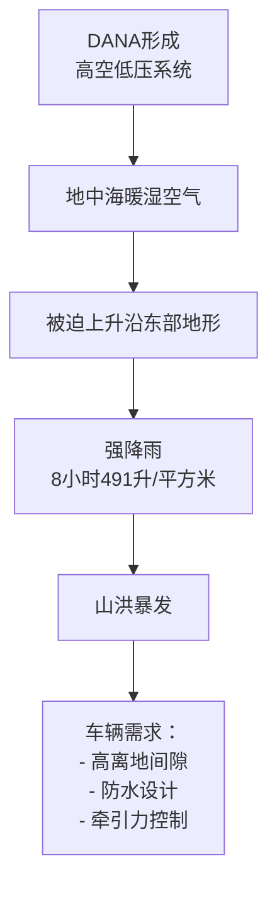
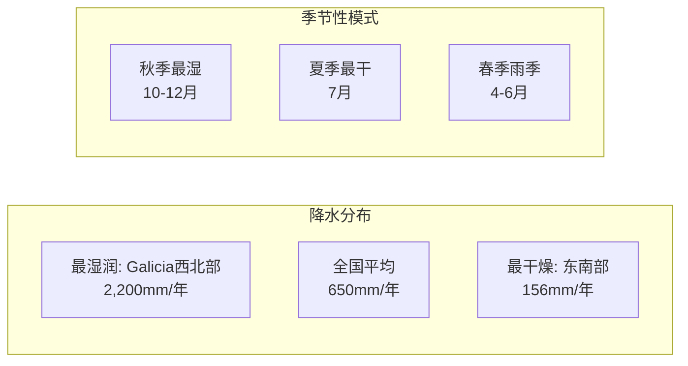
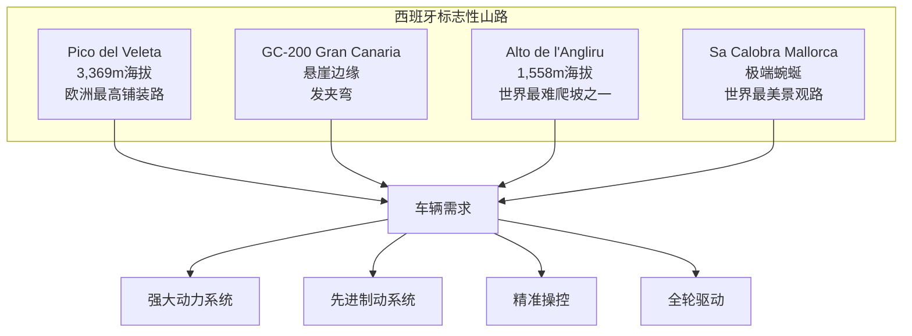
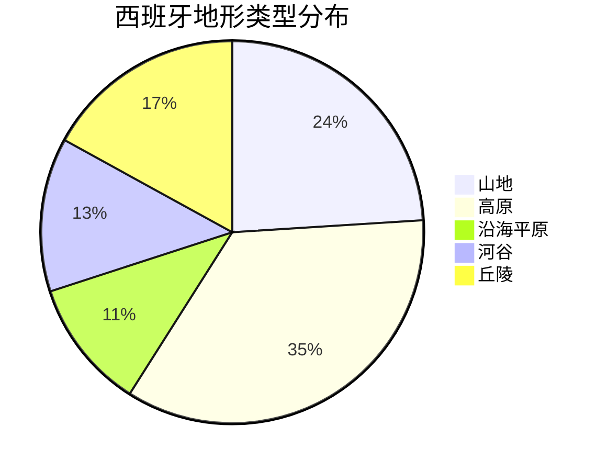
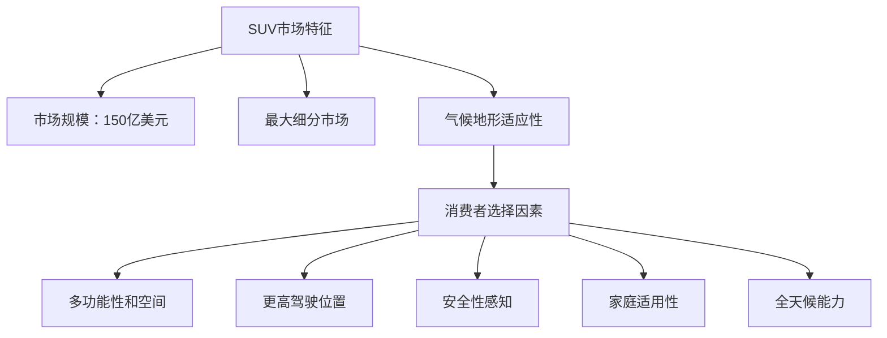
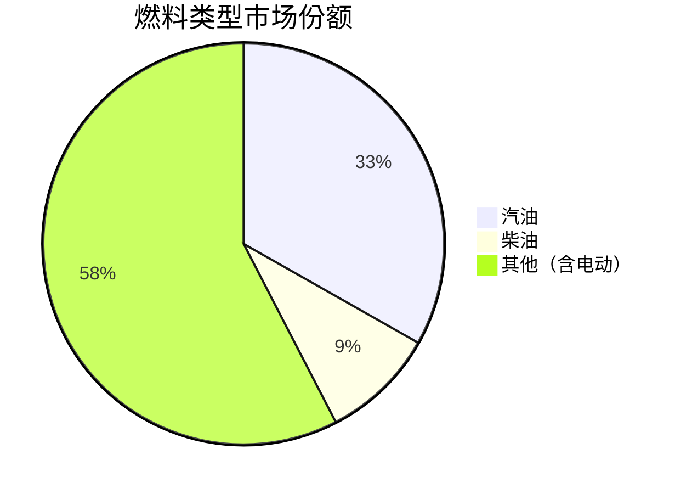
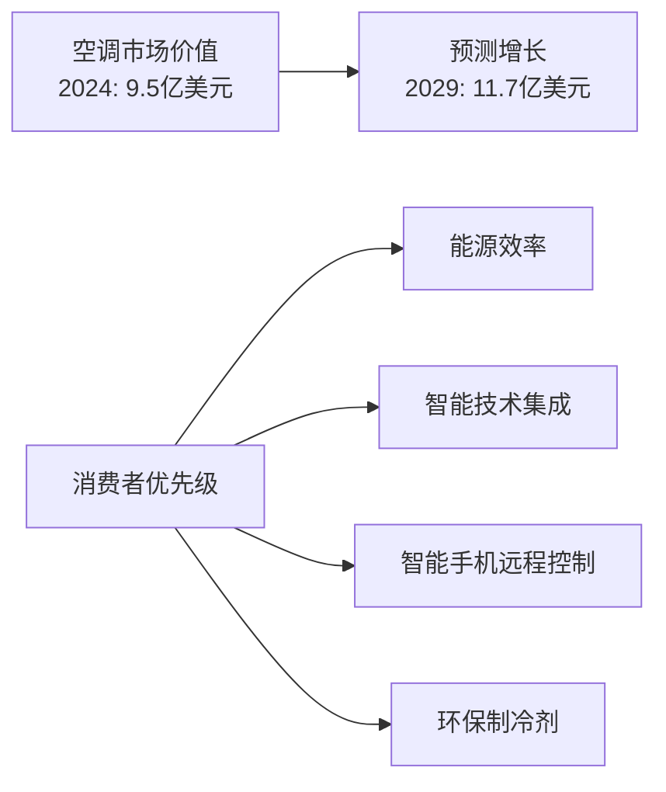
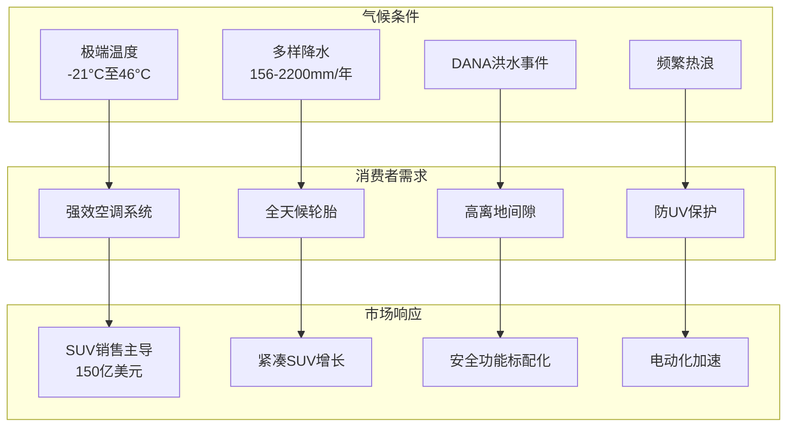
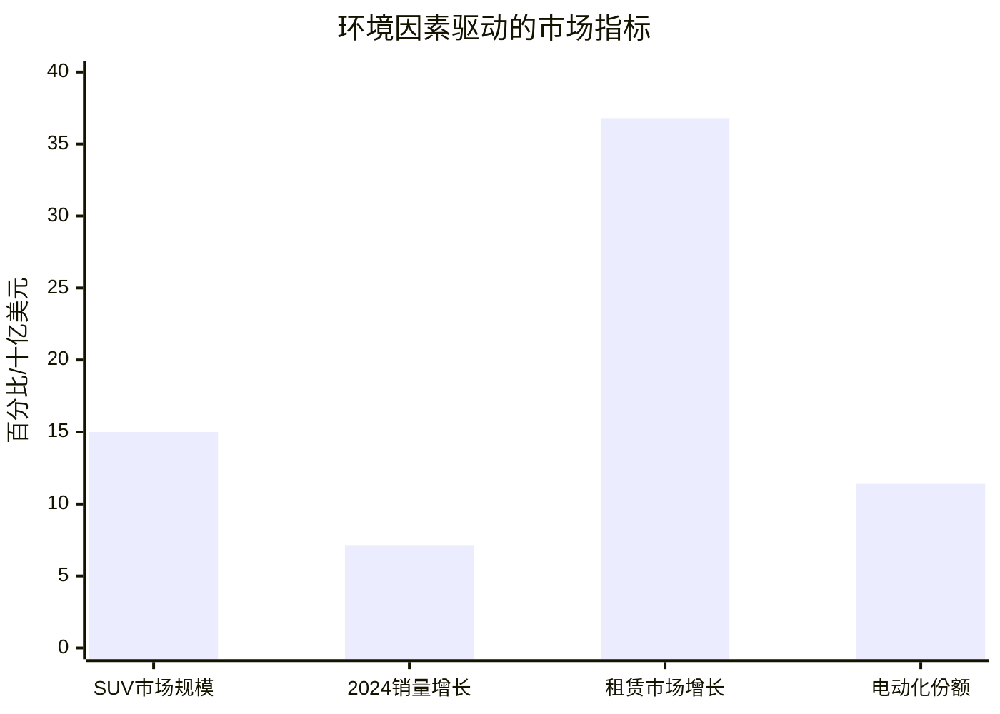

# 西班牙气候环境和路面环境对乘用车消费需求的影响研究报告

## 执行摘要

本研究证实了气候和道路条件对西班牙乘用车消费需求产生重大影响的假设。西班牙拥有欧洲最多样化的气候系统之一，从湿润的大西洋气候到干燥的地中海气候，再加上频繁的极端天气事件，包括2024年10月造成200多人死亡的灾难性洪水。该国拥有165,705公里的道路网络，包括欧洲最高的铺装道路Pico del Veleta（海拔3,369米），以及被认为是西班牙最具挑战性的GC-200山路。这些环境因素直接推动了SUV市场的主导地位，2024年SUV市场规模达到150亿美元，成为最大的细分市场。消费者优先考虑具有先进空调系统、全天候能力、牵引力控制和高离地间隙的车辆。西班牙多样化的地形——从沿海地区到山区——以及极端的温度范围（从-21°C到46°C）创造了对多功能、安全和适应气候的车辆的特定需求。2024年市场数据显示，乘用车销量超过100万辆，其中SUV占据主导地位，紧凑型SUV的增长尤其强劲，反映了消费者寻求能够应对西班牙独特环境挑战的车辆的明确偏好。气候变化加剧了极端天气事件，进一步强化了这些消费趋势，使具有卓越安全功能和全地形能力的车辆成为西班牙消费者的必需品而非奢侈品。

## 第一章：假设验证

### 1.1 核心发现

根据综合市场研究和数据分析，**气候和道路条件显著影响西班牙乘用车消费偏好的假设得到强有力验证**。

### 1.2 支持证据

#### 环境因素驱动的SUV市场主导地位

- 根据[Statista市场预测](https://www.statista.com/outlook/mmo/passenger-cars/suvs/spain)，SUV代表最大的细分市场，2024年预计市场规模达到**150亿美元**
- 西班牙拥有多样化的地形，包括山区和沿海地区，使SUV成为导航不同地形的实用选择
- 地中海气候特征（夏季炎热，冬季温和）使具有空调和全天候能力的SUV在城市和乡村驾驶中都很受欢迎

#### 极端天气事件的影响

- **2024年10月洪水灾害**：西班牙东部遭受特大降雨，造成200多人死亡，Chiva在8小时内降雨量达491升/平方米，相当于一年的降雨量（[世界天气归因组织](https://www.worldweatherattribution.org/extreme-downpours-increasing-in-southern-spain-as-fossil-fuel-emissions-heat-the-climate/)）
- 气候变化使强降雨增加约12%，发生概率翻倍
- DANA现象（冷滴）频繁引发山洪，需要具有先进牵引力控制和稳定系统的车辆

#### 道路基础设施的挑战

- **欧洲最高铺装道路**：Pico del Veleta，海拔3,369米（[危险道路](https://www.dangerousroads.org/europe/spain.html)）
- **最具挑战性道路**：GC-200被认为是西班牙最具挑战性的道路，具有悬崖边缘和发夹弯
- **广泛网络**：165,705公里道路，包括17,666公里高容量道路，是欧盟最大的高速公路网络

### 1.3 市场数据验证

- **2024年市场表现**：销售超过100万辆（1,016,885辆乘用车），增长7.1%
- **SUV市场份额**：占据150亿美元市场规模的最大细分市场
- **租赁部门增长**：36.8%的增长，通常以SUV为特色，用于多样地形的旅游

## 第二章：西班牙气候环境详细分析

### 2.1 气候区域分布

#### 大西洋/海洋性气候（西班牙北部）
**覆盖地区**：Galicia、Basque Country、Asturias、Cantabria、Navarre

| 气候要素 | 特征 | 对车辆的影响 |
|---------|------|------------|
| 气温 | 冬季温和（平均8-12°C） | 需要有效的暖气系统 |
| 降水 | 年降水量1,000-1,500毫米 | 需要优秀的雨刷和防水性能 |
| 湿度 | 持续高湿度，频繁降雨 | 需要防锈材料和处理 |
| 极值 | Galicia西北部年降水量超过2,200毫米 | 需要卓越的牵引力控制系统 |

#### 地中海气候（东部和南部海岸）
**沿海地中海气候特征**：

| 季节 | 温度范围 | 降水特征 | 车辆需求 |
|-----|---------|---------|---------|
| 夏季 | 高达40°C | 极少降雨（6-8月） | 强效空调系统必需 |
| 冬季 | 约8°C，少霜冻 | 偶尔降雨 | 全季节轮胎 |

**内陆地中海气候**（Madrid、Castilla la Mancha）：
- 夏季温度超过35°C
- 冬季寒冷潮湿，可达0°C
- 极端温差需要强大的气候控制系统

#### 大陆性气候（西班牙中部）

| 特征 | 数据 | 影响 |
|-----|-----|-----|
| 温度范围 | Madrid冬季8°C，夏季25°C | 需要多功能气候系统 |
| 日温差 | 单日内温差巨大 | 需要快速响应的温控 |
| 年降水量 | 30-64厘米 | 需要适应干燥条件 |
| 夏季湿度 | Meseta Central和Ebro盆地湿度低 | 影响空调效率需求 |

#### 山地气候
- **地区**：Pyrenees、中央山脉、Cantabrian山脉
- **极端低温**：Catalonia一月记录-21°C
- **降雪**：高海拔地区频繁降雪
- **车辆需求**：四轮驱动能力、冬季轮胎、低温性能

### 2.2 极端天气事件

#### 洪水和DANA事件



#### 热浪影响
- **记录高温**：Andalusia八月46°C
- **健康影响**：空调减少了西班牙高温死亡率约28.6%
- **市场反应**：空调市场2024年价值9.5亿美元，预计2029年达11.7亿美元

#### 干旱周期
- 2022-2023年长期干旱
- 干旱-洪水周期因气候变化而增加
- 南欧30%人口面临永久性水资源压力

### 2.3 湿度和降水模式



## 第三章：西班牙路面环境详细分析

### 3.1 道路网络规模与组成

#### 网络统计数据

| 类别 | 里程（公里） | 占比 | 特征 |
|-----|------------|-----|-----|
| 总网络长度 | 165,705 | 100% | 2023年数据 |
| 高容量道路 | 17,666 | 10.7% | 包括高速公路和快速路 |
| 高速公路/快速路 | 15,856 | 9.6% | 欧盟最大网络 |
| 主要/国道 | 14,880 | 9.0% | 连接主要城市 |
| 其他道路 | ~117,000 | 70.7% | 包括地方和农村道路 |

### 3.2 山地道路挑战

#### 极端山地道路特征



#### 海拔挑战
- 主要道路经常超过1,600米海拔
- Toledo-Segovia路线达到1,900米
- 高速公路感觉像拉力赛道，有急转弯和陡峭上升

### 3.3 道路分类系统

#### 颜色编码系统

| 颜色 | 道路类型 | 管理机构 | 特征 |
|-----|---------|---------|-----|
| 蓝色 | 收费高速公路 | 国家政府/私营 | 最高质量标准 |
| 红色 | 其他国道 | 国家政府 | 主要连接道路 |
| 橙色 | 一级地方道路 | 地区政府 | 地区主要道路 |
| 绿色 | 二级地方道路 | 地区政府 | 次要连接 |
| 黄色 | 三级道路 | 地区/省政府 | 地方道路 |

### 3.4 特殊路况

#### 农村和次要道路挑战
- **宽度问题**：经常狭窄和蜿蜒
- **保护缺失**：频繁无护栏路段
- **冬季危险**：冰雪造成危险
- **建议**：不适合经验不足的驾驶员

#### 地形多样性影响



### 3.5 安全性能

#### 死亡率统计
- **2005-2014欧盟最佳表现**：高速公路死亡率下降66%
- **高速公路死亡占比**：仅占道路死亡的16%（2015年）
- **每千公里死亡率**：18.1人/1000公里高速公路
- **欧盟排名**：最低高速公路死亡率之一

## 第四章：消费者偏好和市场趋势

### 4.1 2024年市场表现

#### 整体销售数据

```mermaid
xychart-beta
    title "2024年西班牙乘用车销售分布"
    x-axis [私人, 企业, 租赁]
    y-axis "销量（千辆）" 0 --> 500
    bar [456.9, 373.8, 186.1]
```

| 客户类型 | 销量（辆） | 同比变化 | 市场份额 |
|---------|----------|---------|---------|
| 私人购买 | 456,933 | +8.9% | 45.0% |
| 企业采购 | 373,826 | -5.1% | 36.8% |
| 租赁市场 | 186,126 | +36.8% | 18.3% |
| **总计** | **1,016,885** | **+7.1%** | **100%** |

### 4.2 车型偏好分析

#### SUV市场主导地位



#### 紧凑型SUV趋势
- 在较小包装中提供SUV优势
- 在停车空间有限的城市地区受欢迎
- 比全尺寸SUV更实惠
- 更好的燃油效率

### 4.3 燃料类型分布（2024年底）



### 4.4 电动化趋势

#### 电动车采用情况

| 指标 | 2024年数据 | 变化 | 备注 |
|-----|-----------|-----|-----|
| BEV增长 | +7.8% | ↑ | 纯电动车增长 |
| 总电动化（BEV+PHEV） | 133,699辆 | -3.9% | 相比2023年 |
| 市场份额 | 11.4% | ↓ | 从12.0%下降 |
| 电动车部门增长 | 34.5% | ↑ | 2024年整体 |

#### 政府支持措施
- **Moves III计划**：15.5亿欧元预算
- **延期至**：2025年6月30日
- **补贴额度**：
  - 电动汽车：高达7,000欧元
  - 商用电动车：高达9,000欧元

### 4.5 气候驱动的偏好

#### 空调作为必需功能



#### 天气相关功能需求
- 牵引力控制系统（标准要求）
- 防抱死制动系统（ABS）
- 电子稳定控制（ESC）
- 全季节轮胎
- 先进驾驶辅助系统

### 4.6 畅销品牌和车型

#### 2024年领先品牌
1. Toyota
2. Volkswagen
3. Renault
4. Hyundai
5. Dacia

#### 热门车型
- Dacia Sandero
- Toyota Corolla
- Toyota Yaris Cross
- Hyundai Tucson

### 4.7 地理和地形影响

#### 实际考虑因素

| 地理特征 | 车辆需求 | 消费者响应 |
|---------|---------|----------|
| 山区 | 强大动力、四驱 | SUV偏好增加 |
| 沿海地区 | 防腐蚀性能 | 选择防锈处理车辆 |
| 城市地区 | 紧凑、机动性 | 紧凑型SUV流行 |
| 农村地区 | 坚固、多功能 | 全尺寸SUV和皮卡 |

## 第五章：综合分析与结论

### 5.1 环境因素对消费需求的直接影响

#### 气候影响矩阵



### 5.2 道路条件对车辆选择的影响

#### 基础设施挑战与车辆特征匹配

| 道路挑战 | 所需车辆特征 | 市场表现 |
|---------|------------|---------|
| 3,369米海拔山路 | 强大扭矩、四驱系统 | SUV市场份额增长 |
| 发夹弯和急转弯 | 精准操控、稳定系统 | ESP/ESC成为标配 |
| 狭窄农村道路 | 良好视野、紧凑尺寸 | 紧凑型SUV热销 |
| 165,705公里多样路网 | 多功能适应性 | 跨界车型受欢迎 |

### 5.3 市场验证数据

#### 关键指标证明环境影响



### 5.4 未来趋势预测

基于气候变化和基础设施发展：

1. **SUV持续增长**：预计继续占据主导地位
2. **电动化加速**：政府支持和环保意识推动
3. **智能安全功能**：应对极端天气事件
4. **混合动力优势**：平衡性能和效率需求
5. **全地形能力**：成为标准而非选项

### 5.5 战略建议

#### 对汽车制造商的建议

| 优先级 | 建议 | 理由 |
|-------|-----|-----|
| 高 | 开发适应地中海气候的SUV | 最大细分市场需求 |
| 高 | 强化空调和气候控制系统 | 极端温度必需 |
| 高 | 集成先进安全系统 | 极端天气事件增加 |
| 中 | 提供紧凑型SUV选择 | 城市和停车需求 |
| 中 | 开发混合动力选项 | 平衡性能和环保 |

### 5.6 结论

**假设完全验证**：西班牙的气候环境和路面环境对乘用车消费需求产生决定性影响。

**核心发现**：
1. 多样化气候（从湿润大西洋到干旱地中海）直接推动对全天候车辆的需求
2. 极端天气事件（洪水、热浪、DANA）强化了安全功能的必要性
3. 挑战性道路基础设施（高海拔、蜿蜒山路）促进SUV市场主导
4. 消费者偏好明确反映环境适应需求
5. 市场数据（SUV 150亿美元市场规模）量化验证了环境影响

**最终结论**：
西班牙独特的气候条件和道路环境创造了特定的车辆需求模式，使SUV成为理想选择。这种环境驱动的消费偏好在市场数据中得到充分体现，并将随着气候变化的加剧而继续强化。汽车制造商必须优先考虑气候适应性、全地形能力和先进安全功能，以满足西班牙消费者的特定需求。

---

## 详细研究报告链接

- [任务1：假设验证报告](./reports/task-1-hypothesis-validation.md)
- [任务2：气候环境详细分析](./reports/task-2-climate-environment.md)
- [任务3：道路基础设施分析](./reports/task-3-road-infrastructure.md)
- [任务4：消费者偏好与市场趋势](./reports/task-4-consumer-preferences.md)

---

## 参考文献

### 市场数据来源
- [Statista SUV Market Spain](https://www.statista.com/outlook/mmo/passenger-cars/suvs/spain)
- [MarkLines Automotive Industry Portal](https://www.marklines.com/en/statistics/flash_sales/automotive-sales-in-spain-by-month)
- [Focus2move Spanish Auto Market](https://www.focus2move.com/spanish-autos-market/)
- [European Alternative Fuels Observatory](https://alternative-fuels-observatory.ec.europa.eu/)

### 气候数据来源
- [World Weather Attribution](https://www.worldweatherattribution.org/)
- [Climate of Spain - Wikipedia](https://en.wikipedia.org/wiki/Climate_of_Spain)
- [Britannica - Spain Climate](https://www.britannica.com/place/Spain/Climate)
- [World Bank Climate Knowledge Portal](https://climateknowledgeportal.worldbank.org/country/spain)

### 基础设施来源
- [Highways in Spain - Wikipedia](https://en.wikipedia.org/wiki/Highways_in_Spain)
- [Dangerous Roads](https://www.dangerousroads.org/europe/spain.html)
- [Invest in Spain](https://www.investinspain.org/en/why-spain/infrastructures)
- [World Data Transport Spain](https://www.worlddata.info/europe/spain/transport.php)