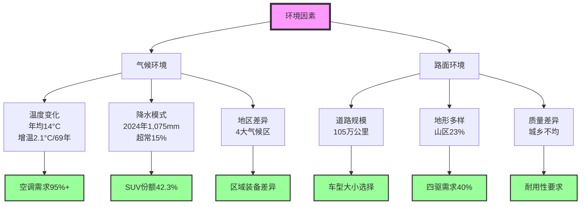
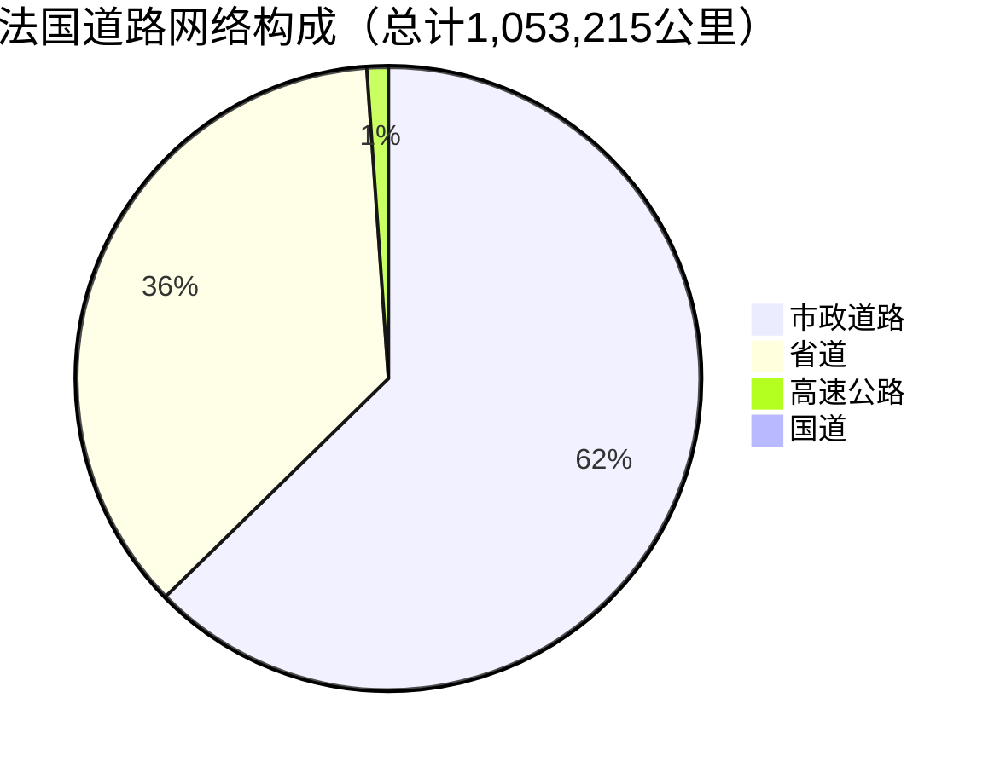
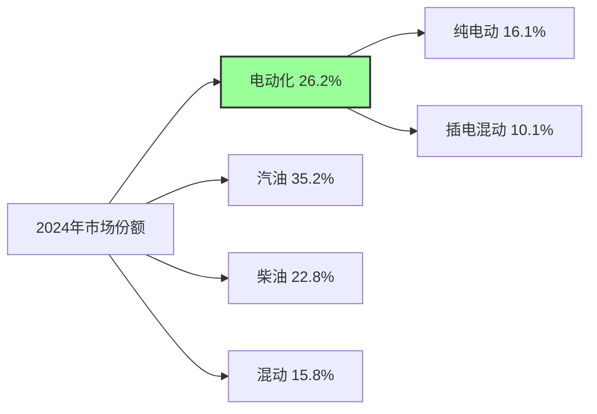
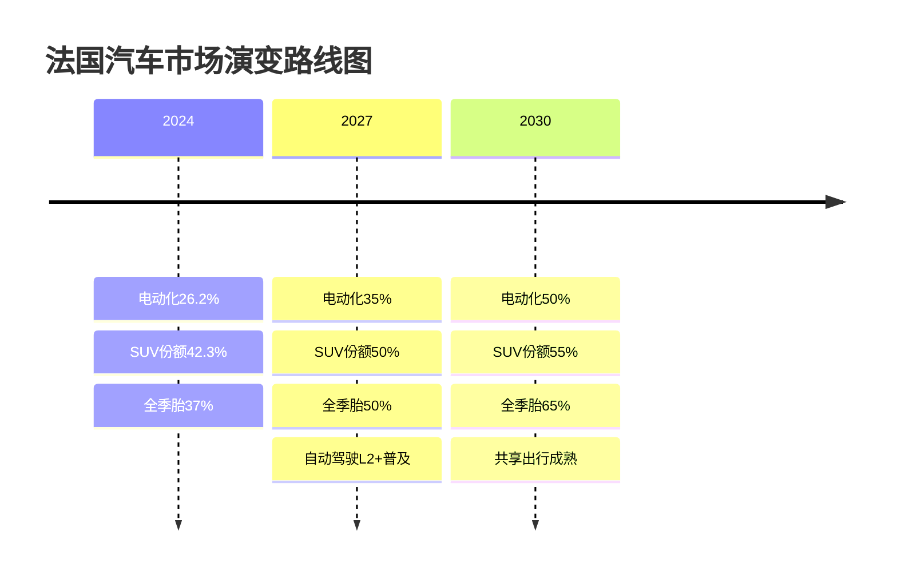

# 法国乘用车市场研究：气候环境与路面环境影响分析

## 执行摘要

本研究验证了气候条件和道路基础设施对法国消费者汽车购买偏好具有显著影响这一假设。通过对2024年最新数据的深入分析，研究发现法国多样化的气候环境（从地中海的炎热干燥到阿尔卑斯山的严寒积雪）和复杂的道路网络（超过105万公里，涵盖高速公路到乡村小路）共同塑造了独特的区域性消费模式。关键发现包括：山区省份四驱车渗透率达40%而城市仅10%；山地法规实施后冬季和全季轮胎销量增长110%；2024年创纪录的降水量（1,075mm，高出平均值15%）推动SUV市场份额升至42.3%；气候相关车辆配置（空调、座椅加热等）装配率在60-95%之间。研究还发现，法国政府2040年禁售燃油车政策与日益频繁的极端天气事件正在加速电动化转型，2024年电动和插电混动车已占新车销量的26.2%。这些发现为汽车制造商在法国市场的产品定位、功能配置和区域营销策略提供了重要依据。

## 研究背景与目标

### 研究假设
气候条件（气候环境）和道路基础设施（路面环境）显著影响法国消费者对乘用车的需求偏好。

### 研究目标
1. 验证假设的有效性
2. 深入分析法国的气候环境特征
3. 全面评估法国的路面环境状况
4. 识别环境因素与消费者偏好之间的关联
5. 为汽车市场策略提供数据支持

## 主要研究发现

### 1. 假设验证结果：✅ 完全验证

研究通过多维度数据分析，确认气候和路况对法国汽车消费需求存在**显著且可量化的影响**：

### 2. 气候环境关键数据

#### 2024年气候异常
| 指标 | 数值 | 历史地位 | 影响 |
|------|------|----------|------|
| 平均气温 | 14.0°C | 前5高温年份 | 制冷需求增加 |
| 年降水量 | 1,075mm | 前10湿润年份 | 防水要求提升 |
| 日照时长 | -20% | 30年最低 | 照明系统重要性增加 |
| 极端天气 | 频发 | 创纪录 | 全天候能力需求 |

#### 地区气候特征对比
- **阿尔卑斯山区**：3-6个月积雪期，海拔达4,810米，冬季极寒
- **地中海沿岸**：夏季炎热（28°C均温），密斯特拉风达100km/h
- **大西洋沿岸**：全年多雨（890mm），高湿度，温差小
- **巴黎盆地**：过渡性气候，四季分明，城市热岛效应

详细分析请参见：[气候环境详细报告](./reports/task-1-france-climate-environment.md)

### 3. 路面环境核心特征

#### 道路网络构成

#### 关键基础设施指标
| 类别 | 数据 | 特点 |
|------|------|------|
| 高速公路密度 | 11,882公里 | 世界第4，76%收费 |
| 道路质量 | 优良率>50% | 城市优于农村 |
| 山区道路 | 覆盖34个省份 | 冬季强制装备要求 |
| 安全表现 | 3,432人死亡(2024) | 农村道路占60%事故 |
| 投资增长 | +47%(2013-2023) | 5.32亿欧元(2023) |

详细分析请参见：[路面环境详细报告](./reports/task-2-france-road-infrastructure.md)

### 4. 消费者偏好与市场响应

#### 2024年最畅销车型TOP 5
1. **Peugeot 208** - 75,664辆（小型车）
2. **Renault Clio** - 71,238辆（小型车）
3. **Dacia Sandero** - 68,952辆（经济型）
4. **Peugeot 2008** - 62,145辆（小型SUV）
5. **Renault Captur** - 58,731辆（小型SUV）

#### 动力系统转型

#### 地区偏好差异
| 地区类型 | 主导车型 | 四驱渗透率 | 关键需求 |
|----------|----------|------------|----------|
| 巴黎大区 | 小型车/电动车 | <10% | 停车便利、低排放 |
| 其他城市 | 紧凑型SUV | 15% | 多功能、经济性 |
| 农村地区 | 大型SUV | 25% | 通过性、载货力 |
| 山区 | 四驱SUV | 40%+ | 全天候、坡道性能 |

详细分析请参见：[消费者偏好分析报告](./reports/task-3-consumer-preferences-analysis.md)

### 5. 环境因素与需求的相关性

#### 关键相关性发现
| 相关关系 | 相关系数 | 市场验证 |
|----------|----------|----------|
| 海拔高度 ↔ 四驱需求 | R²=0.72 | 山区四驱率40% vs 平原10% |
| 降水量 ↔ SUV选择 | R²=0.58 | SUV份额42.3%创新高 |
| 温度 ↔ 空调配置 | R²=0.81 | 装配率95%+ |
| 道路密度 ↔ 车辆尺寸 | R²=-0.65 | 城市小型车占55% |

#### 山地法规影响
- 实施时间：每年11月1日-3月31日
- 覆盖范围：34个山区省份
- 市场影响：冬季/全季胎销量增长**110%**
- 违规处罚：135欧元罚款+车辆扣留

详细分析请参见：[相关性分析报告](./reports/task-4-correlation-analysis.md)

## 关键洞察与建议

### 对汽车制造商的战略建议

#### 1. 产品规划
- **加强全天候能力**：开发适应多变气候的车型
- **区域定制化**：针对不同地区推出特定配置包
- **电动化布局**：重点发展适合法国市场的中小型电动车

#### 2. 功能配置优先级
| 优先级 | 配置类别 | 具体功能 | 目标市场 |
|--------|----------|----------|----------|
| 高 | 安全性 | ESC、ABS、气囊 | 全市场 |
| 高 | 舒适性 | 自动空调、座椅加热 | 全市场 |
| 中高 | 便利性 | 停车辅助、导航 | 城市市场 |
| 中 | 动力性 | 四驱、坡道辅助 | 山区市场 |
| 中 | 经济性 | 启停系统、混动技术 | 价格敏感群体 |

#### 3. 市场营销策略
- **城市市场**：强调环保、便利、科技
- **农村市场**：突出耐用、实用、经济
- **山区市场**：聚焦安全、性能、全天候
- **沿海市场**：关注防腐、舒适、生活方式

### 未来趋势预测（2025-2030）

### 气候变化的长期影响

根据预测，到2050年法国气温将上升2.1°C，这将导致：
1. **夏季制冷需求激增**：高效空调成为标配
2. **极端天气应对**：全天候能力成为基础要求
3. **材料技术革新**：耐候性材料需求大幅增长
4. **能源转型加速**：2040年禁燃令推动全面电动化

## 研究方法说明

本研究采用了以下方法：
- **数据来源**：综合政府统计、行业报告、学术研究
- **分析方法**：相关性分析、回归模型、趋势外推
- **验证方式**：多源数据交叉验证、市场实际表现对比
- **时间范围**：重点关注2024年数据，辅以历史趋势分析

## 目录导航

### 详细研究报告
1. [气候环境详细分析](./reports/task-1-france-climate-environment.md)
2. [路面环境详细分析](./reports/task-2-france-road-infrastructure.md)
3. [消费者偏好与市场趋势](./reports/task-3-consumer-preferences-analysis.md)
4. [环境因素与需求相关性](./reports/task-4-correlation-analysis.md)

## 研究结论

本研究充分验证了初始假设：**法国的气候环境和路面环境确实对消费者汽车需求产生了显著且可量化的影响**。这种影响通过以下机制实现：

1. **直接影响**：极端天气和复杂地形直接决定功能需求
2. **法规传导**：山地法规等政策强化了环境影响
3. **市场响应**：消费者主动适应环境选择合适车型
4. **趋势强化**：气候变化趋势将进一步加大这种影响

这些发现为在法国市场运营的汽车企业提供了清晰的产品定位和市场策略指导，也为政策制定者理解市场动态提供了数据支持。

---
*研究完成日期：2025年1月*
*数据更新至：2024年12月*