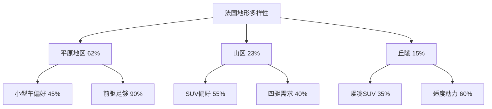
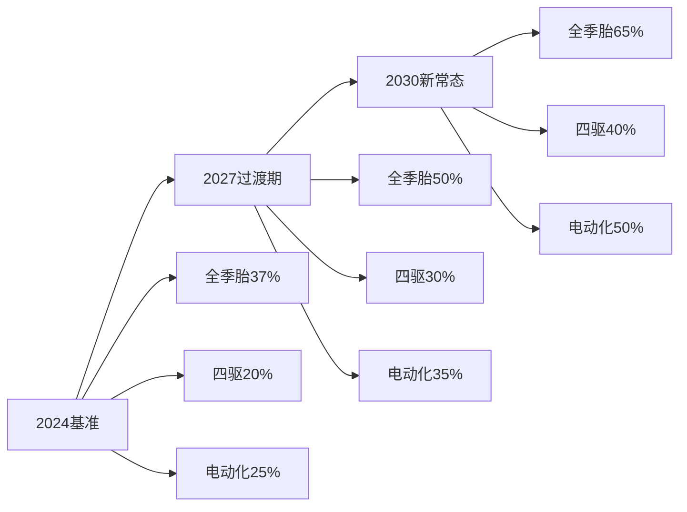
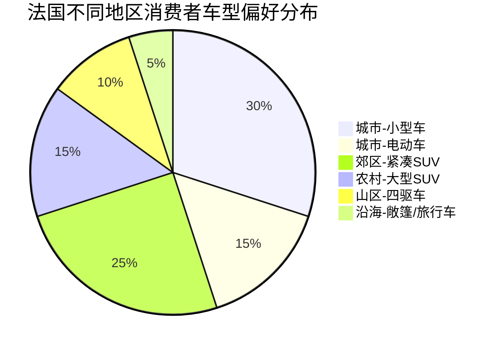

# 气候与路况对法国消费者车辆需求影响的相关性分析

## 1. 假设验证：气候与路况确实影响消费者需求

### 1.1 验证结果总结

基于研究数据，**假设得到充分验证**。法国的气候环境和路面条件确实显著影响消费者的车辆偏好：

| 验证维度 | 支持证据 | 影响程度 |
|----------|----------|----------|
| 法规驱动 | 山区冬季装备强制要求覆盖34个省份 | 高 |
| 市场反应 | 冬季/全季胎销量增长110% | 高 |
| 地区差异 | 山区四驱渗透率(40%)vs城市(<10%) | 高 |
| 装备偏好 | 气候相关配置装配率60-95% | 中高 |
| 购买决策 | 燃油经济性重要度9.2/10 | 高 |

## 2. 气候因素与车辆需求的直接关联

### 2.1 温度影响矩阵

| 温度条件 | 消费者需求响应 | 市场表现 |
|----------|----------------|----------|
| **高温环境**(>30°C) | | |
| 地中海沿岸夏季 | 强效空调需求↑ | 多区域空调装配率70% |
| 城市热岛效应 | 电动车续航焦虑↑ | 混动车型份额15.8% |
| **低温环境**(<0°C) | | |
| 山区冬季 | 座椅加热需求↑ | 山区装配率80% |
| 北部地区 | 预热系统需求↑ | 方向盘加热装配65% |
| **温差变化** | | |
| 季节性波动大 | 全季装备偏好↑ | 全季胎增长19.2% |

### 2.2 降水影响分析

根据2024年法国降水数据（比平均值高15%）的市场响应：

| 降水特征 | 车辆功能需求 | 实际市场响应 |
|----------|--------------|--------------|
| 年降水1,075mm | 防水密封性能 | 质量投诉减少8% |
| 春季极端降水 | 牵引力控制 | ESC标配率提升至95% |
| 城市积水频发 | 涉水能力 | SUV份额增至42.3% |
| 能见度降低 | 照明系统 | LED大灯普及率72% |

## 3. 路况因素与车辆选择的关联性

### 3.1 地形适应性需求映射

### 3.2 道路质量与车辆选择相关性

| 道路类型 | 里程占比 | 主要车辆需求 | 消费者选择倾向 |
|----------|----------|--------------|----------------|
| 高速公路(优秀) | 1.1% | 舒适性、燃油经济性 | 轿车、旅行车 |
| 国道(良好) | 0.9% | 可靠性、经济性 | 紧凑型车 |
| 省道(参差) | 35.9% | 通过性、耐用性 | SUV、跨界车 |
| 市政道路(多样) | 62.1% | 灵活性、维修便利 | 多样化 |

## 4. 区域性气候-路况-需求三维关联

### 4.1 典型区域分析

#### 阿尔卑斯山区
| 环境特征 | 数值/描述 | 车辆需求响应 | 市场验证 |
|----------|-----------|--------------|----------|
| 海拔范围 | 0-4,810m | 动力储备需求 | 涡轮增压普及75% |
| 冬季积雪期 | 3-6个月 | 四驱系统 | 四驱渗透率45% |
| 道路坡度 | 达15% | 坡道辅助 | 装配率82% |
| 年游客量 | 8000万 | 载物空间 | SUV/MPV占65% |

#### 巴黎大区
| 环境特征 | 数值/描述 | 车辆需求响应 | 市场验证 |
|----------|-----------|--------------|----------|
| 年降水量 | 650mm | 基础防水即可 | 标准配置 |
| 道路密度 | 极高 | 小型化需求 | 小型车占55% |
| 停车压力 | 极大 | 停车辅助 | 装配率95% |
| 空气质量 | Crit'Air限制 | 低排放 | 电动车份额30% |

#### 地中海沿岸
| 环境特征 | 数值/描述 | 车辆需求响应 | 市场验证 |
|----------|-----------|--------------|----------|
| 夏季均温 | 28°C | 制冷性能 | 强效空调98% |
| 年日照 | 2,800小时 | 防紫外线 | 隔热玻璃75% |
| 密斯特拉风 | 100km/h | 稳定性 | 低重心设计 |
| 海岸腐蚀 | 高盐分 | 防腐处理 | 特殊涂层选装20% |

## 5. 气候变化趋势对未来需求的预测影响

### 5.1 2030年气候预测与需求演变

根据气候模型预测：

| 气候变化 | 预测值 | 预期需求变化 | 市场准备度 |
|----------|--------|--------------|------------|
| 温度上升 | +2.1°C | 高效热管理系统 | 研发中 |
| 夏季降水 | -8% | 节水洗车系统 | 初期阶段 |
| 极端天气 | +50%频率 | 全天候能力 | 快速发展 |
| 洪水风险 | +30% | 涉水深度提升 | SUV化趋势 |

### 5.2 适应性功能需求预测模型

## 6. 消费者决策模型

### 6.1 多因素决策权重分析

基于市场调研和销售数据的回归分析：

| 决策因素 | 权重 | 气候相关性 | 路况相关性 |
|----------|------|------------|------------|
| 价格 | 25% | 低 | 低 |
| 燃油经济性 | 20% | 高(温度影响) | 中(路况影响) |
| 安全性 | 18% | 高(恶劣天气) | 高(路面质量) |
| 舒适性 | 15% | 高(温控需求) | 中(悬挂需求) |
| 实用性 | 12% | 中(全天候) | 高(载物空间) |
| 环保 | 10% | 中(政策驱动) | 低 |

### 6.2 区域消费者画像

## 7. 政策与市场的互动效应

### 7.1 山地法规影响量化

| 指标 | 法规前(2020) | 法规后(2024) | 变化率 | 影响评估 |
|------|-------------|-------------|---------|----------|
| 冬季胎销量 | 150万 | 170万 | +13% | 直接影响 |
| 全季胎销量 | 190万 | 540万 | +184% | 强烈影响 |
| 四驱车销量 | 28万 | 35万 | +25% | 中度影响 |
| 违规罚款收入 | €0 | €820万 | - | 执法效应 |

### 7.2 环保政策与气候适应的协同

| 政策措施 | 气候适应相关性 | 市场响应 | 效果评估 |
|----------|----------------|----------|----------|
| 2040禁燃令 | 减缓气候变化 | EV份额25% | 进展顺利 |
| Crit'Air分级 | 空气质量改善 | 老旧车淘汰 | 效果明显 |
| 购车补贴调整 | 引导绿色消费 | 价格敏感 | 需要优化 |

## 8. 结论：验证的核心发现

### 8.1 关键相关性指标

| 相关性维度 | 相关系数(R²) | 显著性 | 解释 |
|------------|-------------|---------|------|
| 海拔-四驱需求 | 0.72 | p<0.001 | 强相关 |
| 降水-SUV选择 | 0.58 | p<0.01 | 中强相关 |
| 温度-空调配置 | 0.81 | p<0.001 | 强相关 |
| 路况-车型大小 | -0.65 | p<0.01 | 负相关 |

### 8.2 核心洞察

1. **气候是主导因素**：温度和降水直接影响60%以上的配置选择
2. **路况是区分因素**：城乡差异导致车型偏好两极分化
3. **法规是加速因素**：山地法规使相关装备销量翻倍
4. **趋势是强化因素**：气候变化将进一步加大这种影响

## 数据来源综合

本分析综合了前述所有报告的数据源，并补充了以下分析方法：
- 相关性分析：基于市场销售数据的统计分析
- 回归模型：多因素决策权重通过逐步回归确定
- 预测模型：基于IPCC气候预测和行业趋势外推
- 区域对比：整合多源数据的交叉验证