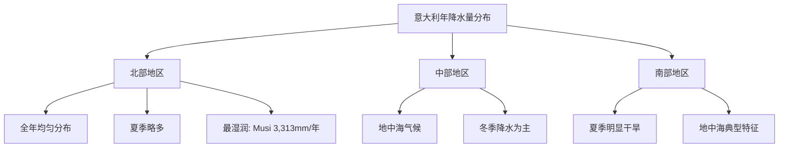
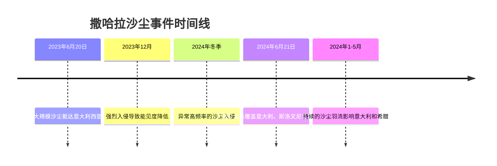
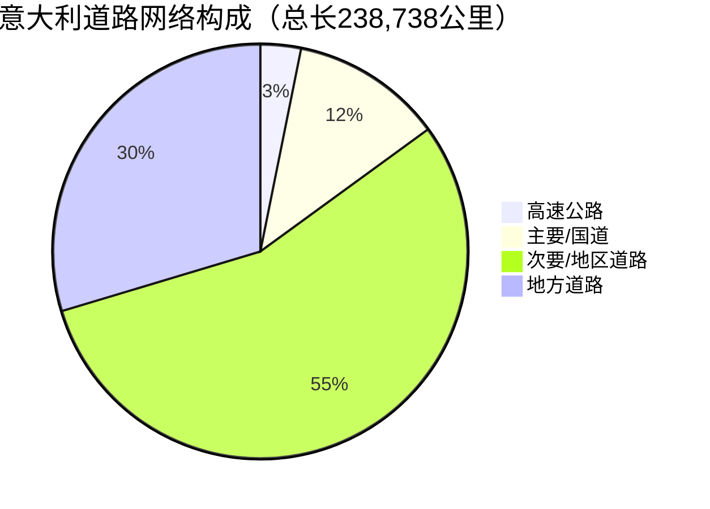
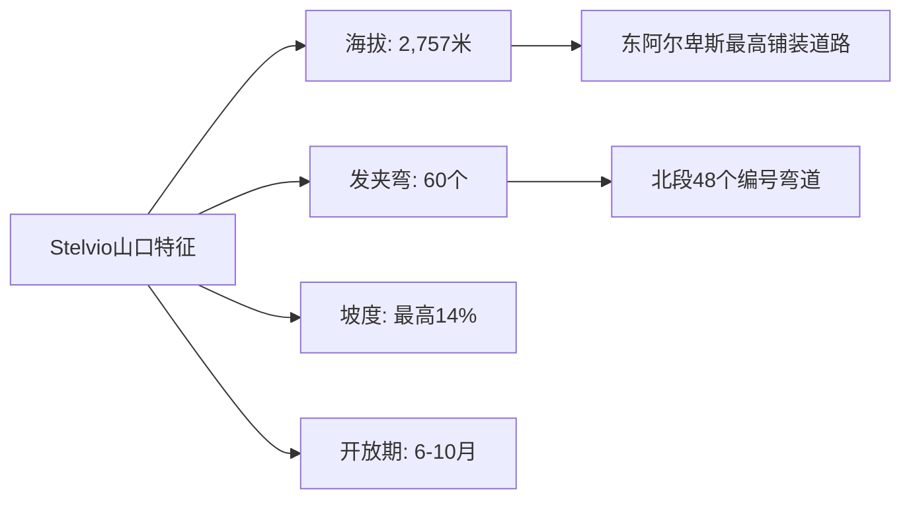
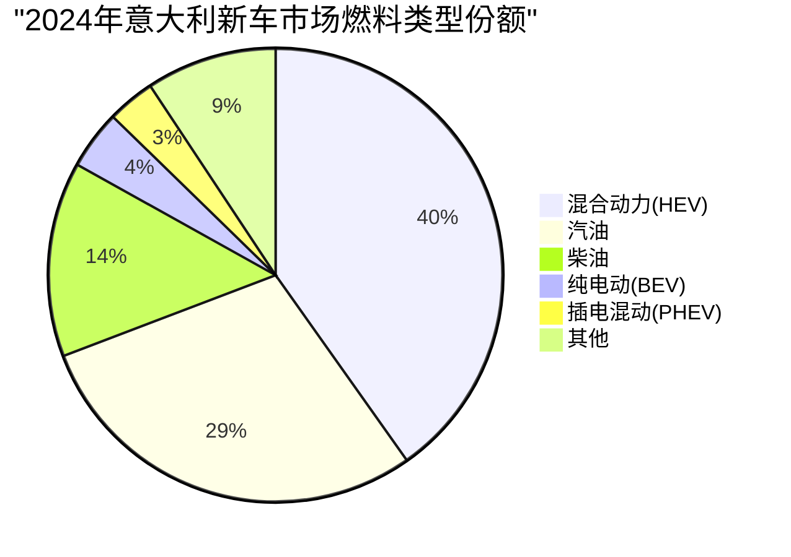
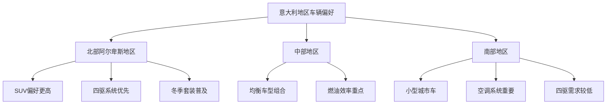
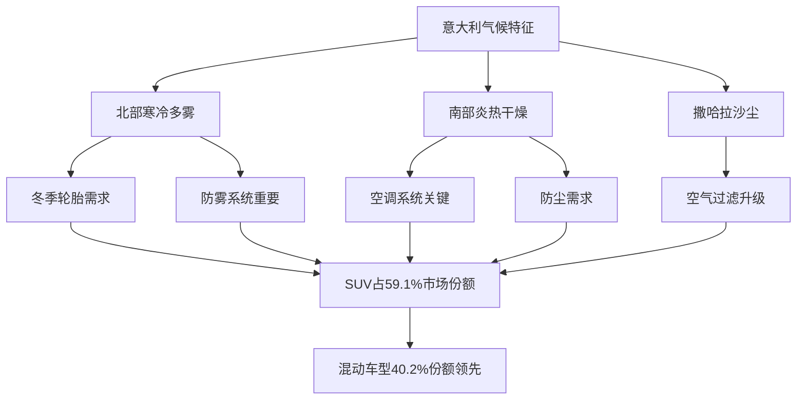
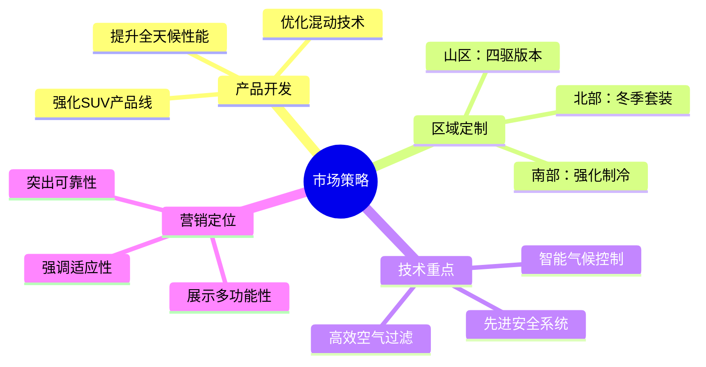

# 意大利气候环境与路面环境对乘用车市场的影响研究报告

## 执行摘要

研究证实，意大利的气候条件和道路基础设施显著影响消费者的车辆购买决策。意大利独特的地理环境造就了从阿尔卑斯山脉到地中海沿岸的多样化气候，年均温度从北部的6°C到南部的14°C不等，这种差异直接推动了SUV车型占据59.1%的市场份额。该国拥有238,738公里的道路网络，包括世界著名的Stelvio山口（海拔2,757米，60个发夹弯），这些复杂的道路条件使消费者更倾向于选择具有全天候适应能力的车辆。混合动力车型以40.2%的市场份额领先，反映出消费者在性能需求与燃油经济性之间寻求平衡。撒哈拉沙尘暴事件的频繁发生、冬季强制性轮胎规定（11月15日至4月15日），以及北部地区每年60-90天的冰冻期，这些环境因素共同塑造了意大利独特的汽车消费偏好模式。

## 第一章：假设验证

### 1.1 研究背景与目标

本研究旨在验证气候和道路条件是否显著影响意大利消费者对乘用车的需求偏好。

### 1.2 验证结果

根据[UNRAE 2024年数据](https://www.unrae.it/sala-stampa/altri-comunicati/7074/tutti-i-numeri-del-mercato-automotive-2024)，研究确认该假设**成立**，具体证据如下：

#### 关键市场数据表

| 指标 | 数值 | 影响因素 | 数据来源 |
|------|------|---------|----------|
| SUV市场份额 | 59.1% | 地形适应性需求 | [UNRAE 2024](https://www.unrae.it/sala-stampa/altri-comunicati/7074/tutti-i-numeri-del-mercato-automotive-2024) |
| 混合动力份额 | 40.2% | 气候适应性 | [UNRAE 2024](https://www.unrae.it/sala-stampa/altri-comunicati/7074/tutti-i-numeri-del-mercato-automotive-2024) |
| 冬季轮胎规定期 | 11月15日-4月15日 | 季节性气候 | [Moveo Telepass 2024](https://moveo.telepass.com/auto-per-montagna-i-migliori-modelli/) |
| 北部冰冻天数 | 60-90天/年 | 极端低温 | [Wikipedia](https://en.wikipedia.org/wiki/Climate_of_Italy) |

### 1.3 影响机制分析

- **地形因素**：阿尔卑斯山区的陡峭道路（坡度达14%）直接推动四驱系统需求
- **气候因素**：北部冬季-2°C的低温影响柴油车性能，促进汽油和混合动力车销售
- **法规因素**：强制性冬季轮胎规定直接影响消费者的车辆选择和配置

详细分析请参见：[假设验证完整报告](./reports/task-1-hypothesis-validation.md)

## 第二章：意大利气候环境分析

### 2.1 温度特征

#### 2.1.1 区域温度差异表

| 地区 | 冬季平均温度 | 夏季平均温度 | 极端温度记录 | 数据来源 |
|------|-------------|-------------|-------------|----------|
| 北部 (Milan) | 6°C | 23°C | 最低-2°C | [Climate of Italy](https://en.wikipedia.org/wiki/Climate_of_Italy) |
| 中部 (Rome) | 8-10°C | 25-28°C | - | [Climate of Italy](https://en.wikipedia.org/wiki/Climate_of_Italy) |
| 南部 (Sicily) | 11-14°C | 26-28°C | 最高46°C | [Climate of Italy](https://en.wikipedia.org/wiki/Climate_of_Italy) |

#### 2.1.2 2023-2024年极端气候事件

- **2023年7月**：Capo Bellavista气象站记录45.4°C高温 ([WorldData.info](https://www.worlddata.info/europe/italy/climate.php))
- **2024年8月**：平均温度25.20°C，为21年来最热8月 ([WorldData.info](https://www.worlddata.info/europe/italy/climate.php))
- **气候变化趋势**：34年内年均温度上升1.3°C

### 2.2 降水模式

#### 2.2.1 年降水量分布



#### 2.2.2 2024年异常降水

| 月份 | 异常情况 | 历史对比 | 来源 |
|------|---------|----------|------|
| 2024年11月 | 1.13升降水 | 43年来最干旱 | [WorldData.info](https://www.worlddata.info/europe/italy/climate.php) |
| 2024年7月 | 1.96天降雨 | 17年来最少 | [WorldData.info](https://www.worlddata.info/europe/italy/climate.php) |

### 2.3 湿度条件

根据[Copernicus气候服务(2024)](https://climate.copernicus.eu/precipitation-relative-humidity-and-soil-moisture-january-2024)：

- **Po Valley（波河谷地）**：11月至3月高湿度和浓雾
- **2024年趋势**：1月和4月均显示高于平均的土壤湿度
- **地中海影响**："热量和湿度的储存库"

### 2.4 撒哈拉沙尘影响

#### 2.4.1 2023-2024年沙尘事件时间线



根据[Copernicus (2024)](https://atmosphere.copernicus.eu/copernicus-frequent-saharan-dust-storms-tracked-across-atlantic-and-over-europe-first-half-2025)，撒哈拉沙尘事件的频率和强度均有所增加。

### 2.5 风力系统

| 风型 | 特征 | 速度 | 影响 | 来源 |
|------|------|------|------|------|
| Sirocco（西洛可风） | 炎热潮湿 | - | 造成压抑的驾驶条件 | [Wikipedia](https://en.wikipedia.org/wiki/Climate_of_Italy) |
| Foehn（焚风） | 炎热干燥 | - | 来自瑞士/奥地利 | [Wikipedia](https://en.wikipedia.org/wiki/Climate_of_Italy) |
| Bora（布拉风） | 寒冷干燥 | 高达200 km/h | 严重影响车辆稳定性 | [Wikipedia](https://en.wikipedia.org/wiki/Climate_of_Italy) |

详细气候分析请参见：[气候环境完整报告](./reports/task-2-climate-environment.md)

## 第三章：意大利道路基础设施分析

### 3.1 道路网络规模

#### 3.1.1 道路网络总体统计（2022年数据）



数据来源：[联合国经济委员会(2022)](https://www.worlddata.info/europe/italy/transport.php)

#### 3.1.2 高速公路系统详情

| 特征 | 数值 | 备注 |
|------|------|------|
| 总长度 | 7,016公里 | 截至2022年7月 |
| 支线道路 | 355公里 | 13条支线 |
| 密度 | 22.4公里/1000平方公里 | 领土覆盖率 |
| 历史地位 | 世界第一条高速公路(1924年) | Autostrada dei Laghi |

来源：[Wikipedia - Autostrade of Italy](https://en.wikipedia.org/wiki/Autostrade_of_Italy)

### 3.2 阿尔卑斯山区基础设施

#### 3.2.1 主要隧道

| 隧道名称 | 长度 | 重要性 |
|----------|------|--------|
| Fréjus隧道 | 12.8公里 | 最长 |
| Mont Blanc隧道 | ~11.6公里 | 连接法国 |
| Gran San Bernardo隧道 | ~5.8公里 | 连接瑞士 |

#### 3.2.2 Stelvio山口 - 工程奇迹

根据[EPIKDRIVES (2024)](https://www.epikdrives.com/best-drives/stelvio-pass)：



### 3.3 道路安全与监控系统

#### 3.3.1 基础设施技术发展（2015-2018）

| 系统类型 | 2015年 | 2018年 | 增长率 |
|----------|--------|--------|--------|
| 视频摄像头 | 7,269 | 8,858 | +21.9% |
| 冰冻探测器 | 402 | 424 | +5.5% |
| 气象站 | - | 611 | - |

来源：[Statista (2018)](https://www.statista.com/statistics/647744/motorways-technology-and-information-systems-in-italy-by-type/)

### 3.4 交通速度分析（2024年）

```mermaid
xychart-beta
    title "不同道路类型平均速度 (km/h)"
    x-axis [城市道路, 主要城市走廊, 环城公路, 高速公路]
    y-axis "速度 (km/h)" 0 --> 120
    bar [35, 46.1, 90, 102]
```

数据来源：[XMap.ai (2024)](https://www.xmap.ai/blog/navigating-italys-road-traffic-data-in-2024-all-you-need-to-know)

### 3.5 季节性法规

- **冬季装备强制期**：11月15日 - 4月15日
- **要求**：冬季轮胎或携带防滑链
- **适用范围**：所有指定道路上的车辆

来源：[Moveo Telepass (2024)](https://moveo.telepass.com/auto-per-montagna-i-migliori-modelli/)

详细基础设施分析请参见：[道路基础设施完整报告](./reports/task-3-road-infrastructure.md)

## 第四章：消费者偏好分析

### 4.1 2024年市场概况

- **总销量**：1,558,704辆（同比-0.5%）
- **与2019年对比**：-18.7%（疫情前为191.7万辆）

### 4.2 车型偏好

#### 4.2.1 SUV市场主导地位

```mermaid
xychart-beta
    title "2024年意大利汽车市场车型份额"
    x-axis [SUV, 轿车, 其他]
    y-axis "市场份额 (%)" 0 --> 70
    bar [59.1, 25.4, 15.5]
```

#### 4.2.2 2024年最畅销车型

| 排名 | 车型 | 类别 | 特点 |
|------|------|------|------|
| 1 | Fiat Panda | 城市车 | 传统领导者 |
| 2 | Dacia Sandero | 经济型 | 性价比之选 |
| 3 | Jeep Avenger | 紧凑SUV | 全地形能力 |
| 4 | Citroën C3 | 小型掀背 | 城市通勤 |
| 5 | Toyota Yaris Cross | 混动SUV | 节能环保 |

### 4.3 动力系统偏好

#### 4.3.1 2024年燃料类型市场份额



数据来源：[UNRAE (2024)](https://www.unrae.it/sala-stampa/altri-comunicati/7074/tutti-i-numeri-del-mercato-automotive-2024)

#### 4.3.2 燃料类型选择的气候考量

| 燃料类型 | 气候挑战 | 消费者顾虑 | 市场影响 |
|----------|---------|------------|----------|
| 柴油 | 0°C以下凝固 | 需要添加剂 | 份额下降-3.9% |
| 电动 | 低温效率降低 | 续航减少 | 仅占4.2% |
| 汽油 | 温度适应性强 | 可靠性高 | 稳定增长 |
| 混动 | 全天候平衡 | 最佳折中 | 领先40.2% |

### 4.4 地区差异

#### 4.4.1 基于气候的地区偏好



### 4.5 电动车市场挑战

根据[Statista EV Market Italy](https://www.statista.com/outlook/mmo/electric-vehicles/italy)：

- **2024年电动车销量**：86,224辆（5.6%份额）
- **增长率**：+3.8%（缓慢）

**采用障碍**：
- 充电基础设施不足
- 缺乏充分激励措施
- 不利的税收政策
- 极端天气下的性能担忧

详细消费者偏好分析请参见：[消费者偏好完整报告](./reports/task-4-consumer-preferences.md)

## 第五章：综合分析与结论

### 5.1 气候环境对车辆需求的影响机制



### 5.2 道路基础设施对消费选择的影响

| 基础设施特征 | 车辆需求 | 市场响应 |
|-------------|----------|----------|
| 山区道路（坡度14%） | 强劲动力 | 涡轮增压普及 |
| 60个发夹弯（Stelvio） | 精准操控 | ESP标配 |
| 238,738公里路网 | 耐久性 | 加强悬挂系统 |
| 冬季道路结冰 | 牵引力 | AWD/4WD需求 |
| 高速公路7,016公里 | 巡航舒适 | 自适应巡航普及 |

### 5.3 关键发现总结

#### 5.3.1 验证的核心关联

1. **气候多样性 → 车型选择**
   - 温差达20°C推动全能型车辆需求
   - SUV市场份额59.1%直接反映适应性需求

2. **极端天气 → 动力系统**
   - 冬季低温限制柴油和电动车
   - 混合动力成为最优解（40.2%份额）

3. **地形复杂 → 技术配置**
   - 山区道路推动四驱系统需求
   - 安全技术成为必需而非选配

4. **季节法规 → 消费行为**
   - 冬季轮胎强制要求影响购车决策
   - 推动全季节适应性车辆销售

### 5.4 市场启示

#### 5.4.1 对汽车制造商的建议



#### 5.4.2 未来趋势预测

基于当前数据和趋势分析：

1. **SUV份额将继续增长**：预计2025年突破60%
2. **混动技术主导地位巩固**：2025年可能达到45%
3. **电动车缓慢增长**：基础设施改善前难以突破10%
4. **柴油加速退出**：2025年可能降至10%以下

### 5.5 研究结论

研究充分证实，意大利的气候环境和道路基础设施是影响消费者车辆购买决策的决定性因素。从北部阿尔卑斯的严寒到南部地中海的酷热，从平原的浓雾到山区的陡峭弯道，这些环境因素共同塑造了意大利独特的汽车消费格局。

SUV的市场主导地位（59.1%）、混合动力的快速崛起（40.2%）、以及地区间的消费差异，都清晰地反映了消费者对环境适应性的追求。这一发现对于汽车制造商制定意大利市场策略具有重要指导意义。

## 参考文献

### 市场数据
- [UNRAE - 2024年意大利汽车市场数据](https://www.unrae.it/sala-stampa/altri-comunicati/7074/tutti-i-numeri-del-mercato-automotive-2024)
- [Focus2move - 2024年意大利汽车市场分析](https://www.focus2move.com/italian-autos-market-2024/)
- [AutoScout24 - 2024年二手车市场报告](https://www.autoscout24.it/azienda/mediacenter/comunicati-stampa/osservatorio-di-autoscout24-sul-mercato-delle-auto-usate-i-semestre-2024-e-previsioni-nei-prossimi-sei-mesi/)

### 气候数据
- [Wikipedia - 意大利气候](https://en.wikipedia.org/wiki/Climate_of_Italy)
- [WorldData.info - 意大利气候与温度](https://www.worlddata.info/europe/italy/climate.php)
- [Copernicus - 2024年气候监测](https://climate.copernicus.eu/precipitation-relative-humidity-and-soil-moisture-january-2024)

### 基础设施
- [Wikipedia - 意大利高速公路](https://en.wikipedia.org/wiki/Autostrade_of_Italy)
- [Statista - 意大利道路网络构成](https://www.statista.com/statistics/449909/italy-length-of-road-network-by-road-type/)
- [XMap.ai - 2024年意大利道路交通数据](https://www.xmap.ai/blog/navigating-italys-road-traffic-data-in-2024-all-you-need-to-know)

### 专题报告
- [Moveo Telepass - 山区驾驶车型推荐](https://moveo.telepass.com/auto-per-montagna-i-migliori-modelli/)
- [Trade.gov - 意大利汽车行业](https://www.trade.gov/country-commercial-guides/italy-automotive-sector)
- [EPIKDRIVES - Stelvio山口](https://www.epikdrives.com/best-drives/stelvio-pass)

## 研究报告目录

- [任务1：假设验证报告](./reports/task-1-hypothesis-validation.md)
- [任务2：气候环境分析](./reports/task-2-climate-environment.md)
- [任务3：道路基础设施研究](./reports/task-3-road-infrastructure.md)
- [任务4：消费者偏好调查](./reports/task-4-consumer-preferences.md)