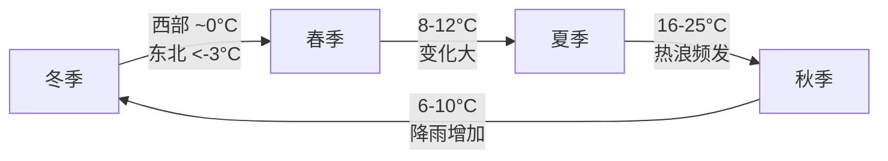
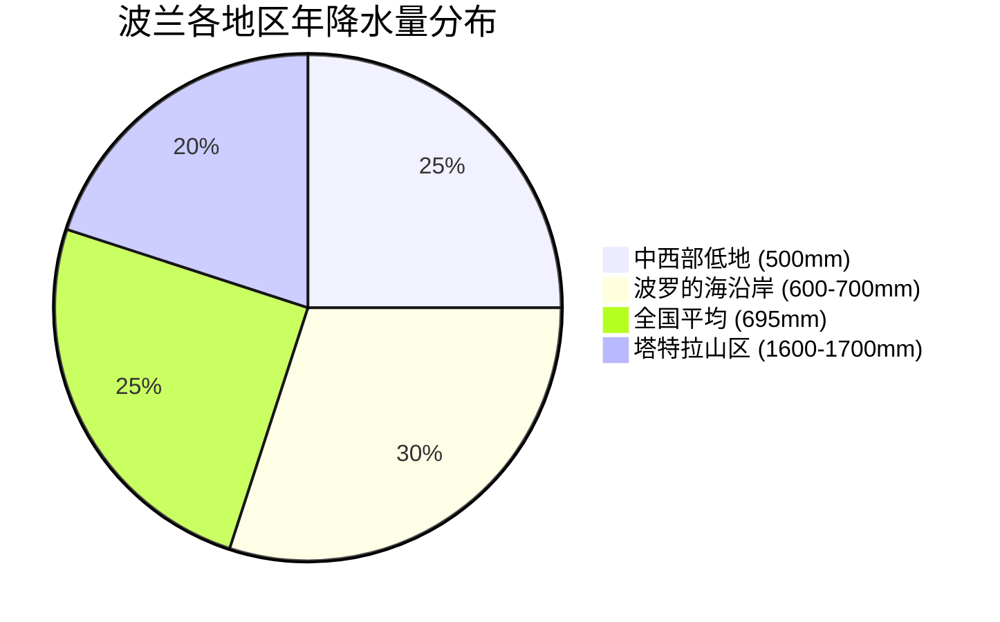
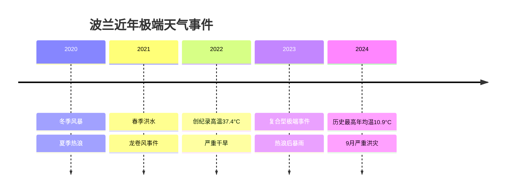
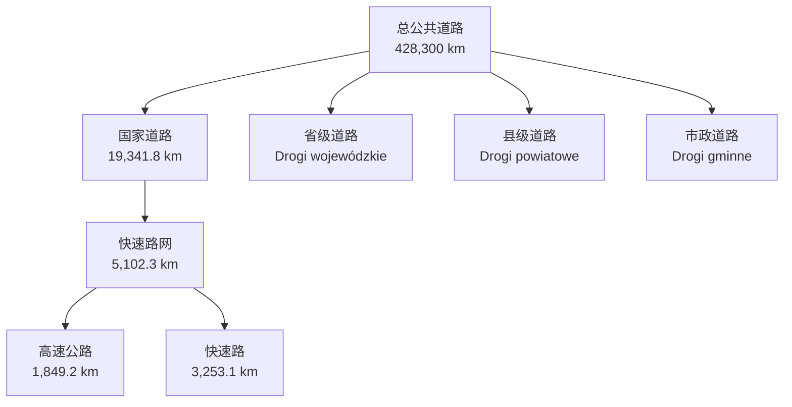
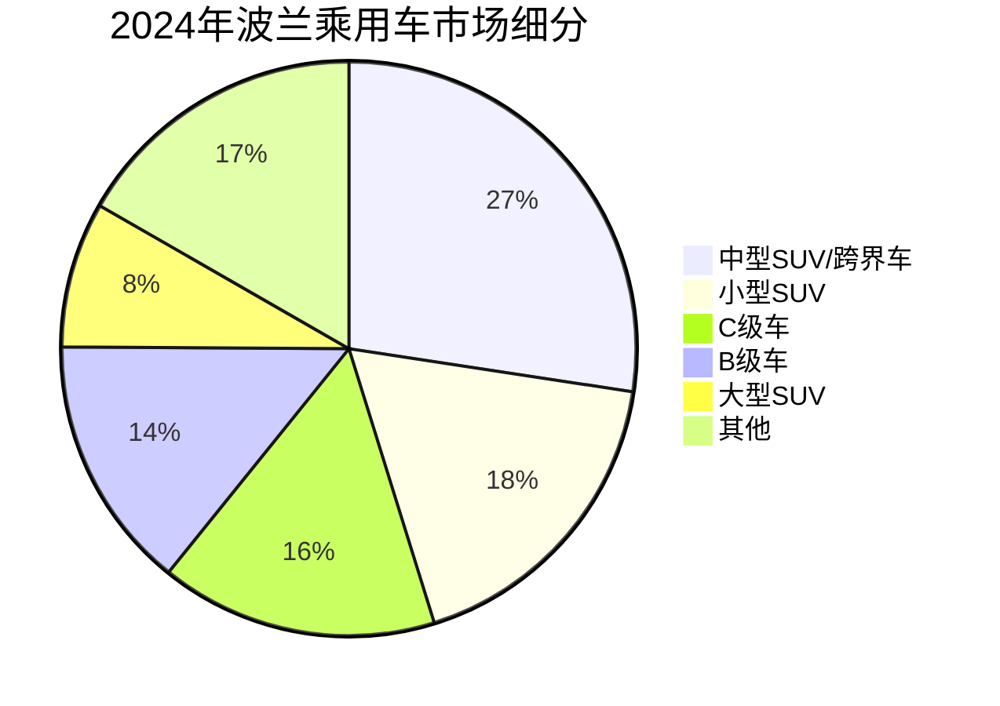
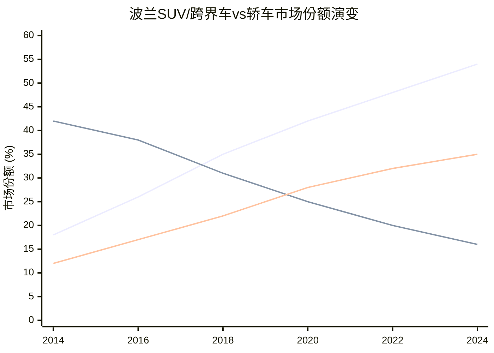
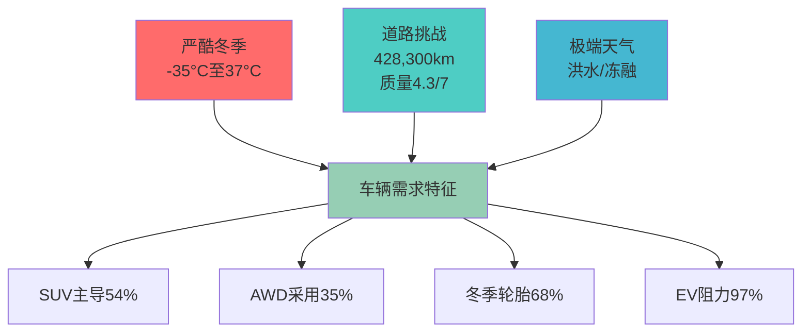
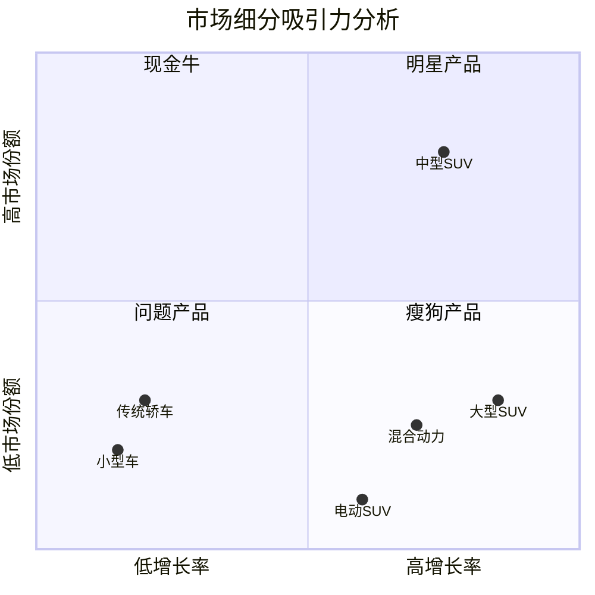

# 波兰乘用车市场研究：气候环境与路面环境影响分析

## 执行摘要

本研究深入分析了波兰的气候环境和路面基础设施如何影响消费者对乘用车的需求偏好。研究发现，波兰独特的环境条件——包括严酷的冬季气候（温度可降至-35°C）、年降水量695毫米、以及428,300公里质量参差不齐的道路网络——显著塑造了当地汽车市场格局。数据显示，SUV和跨界车占据54%的市场份额，35%的新车配备全轮驱动系统，68%的消费者自愿使用冬季轮胎，这些趋势有力验证了环境因素对车辆需求的决定性影响。波兰正在实施历史上最大规模的道路建设计划（2900亿兹罗提投资），但现有的基础设施挑战，包括城市拥堵（华沙年均损失70小时）和道路质量问题（全球排名第57位），继续推动消费者选择更加坚固、适应性更强的车辆。研究为汽车制造商提供了关键洞察：在波兰市场成功需要优先考虑寒冷天气性能、提供全轮驱动选项、确保足够的离地间隙，并适应从传统轿车向SUV的市场转变趋势。

## 研究背景与目标

### 研究假设
气候条件和道路基础设施状况显著影响波兰消费者对乘用车的偏好和需求模式。

### 研究目标
1. **验证假设** - 确定气候和道路条件是否真正影响波兰的消费者需求
2. **深度分析** - 如果假设得到验证，进行以下方面的详细研究：
   - 气候环境：温度、湿度、降水、沙尘等影响乘用车驾驶的气候要素
   - 路面环境：道路网络规模、质量、特殊路况等影响乘用车驾驶的路面要素

### 研究方法
- 综合使用英语和波兰语资源
- 分析官方政府数据、行业报告和学术研究
- 验证所有数据点并提供原始来源链接

## 第一章：波兰气候环境分析

### 1.1 温度特征

根据[波兰气象与水管理研究所(IMGW-PIB)](https://imgw.pl/en/)的数据：

#### 年度温度模式

| 指标 | 数值 | 趋势 |
|------|------|------|
| 全国年均温度 | 7-8.5°C | 上升中 |
| 2024年记录 | 10.9°C | 自1951年以来最高 |
| 70年温度变化 | +2.8°C | 每十年+0.33°C |
| 极端低温记录 | -41.0°C | 历史记录 |
| 极端高温记录 | 37.4°C | 2022年7月 |

#### 季节性变化



#### 区域气候差异

波兰存在三个distinct气候区：
- **波罗的海沿岸（海洋性）**：受海洋影响，温度较温和
- **中部波兰（大陆性）**：温度波动较大，夏热冬寒
- **南部山区（高山性）**：最寒冷地区，温度随海拔下降

### 1.2 降水模式

根据[世界银行气候知识门户](https://climateknowledgeportal.worldbank.org/country/poland)：

#### 年降水量分布



#### 降雪覆盖
- **持续时间**：北部/西部40天，南部/东部60-70天
- **山区**：每年长达100天
- **深度**：东北地区可超过50厘米

### 1.3 湿度水平

根据[大气科学期刊研究](https://www.mdpi.com/journal/atmosphere)：
- **全国平均相对湿度**：78.3%
- **季节范围**：5月68%至11-12月88-89%
- **长期趋势**：自1966年以来显著下降，特别是春夏季节

### 1.4 极端天气事件

#### 2020-2024年极端天气模式



### 1.5 对车辆运行的影响

#### 冬季挑战

| 系统 | 影响 | 建议对策 |
|------|------|----------|
| 电池性能 | 0°C时损失35%，-18°C时损失60% | 电池加热器、高CCA电池 |
| 机油粘度 | 0°C以下显著增加 | 使用5W-20、0W级别机油 |
| 燃油系统 | 汽油汽化困难，柴油凝胶化 | 燃油添加剂、油箱加热 |
| 启动电流 | 需要正常的2倍 | 发动机预热器 |

详细气候分析请参见：[气候环境详细报告](./reports/task-1-climate-environment.md)

## 第二章：波兰路面基础设施分析

### 2.1 道路网络规模

根据[国家道路和高速公路总局(GDDKiA)](https://www.gov.pl/web/gddkia/)：

#### 道路网络构成（2024年）



### 2.2 道路质量指标

根据[世界经济论坛](https://www.weforum.org/)和[TomTom交通指数](https://www.tomtom.com/traffic-index/)：

#### 国际排名对比

| 国家 | 道路质量指数(1-7) | 全球排名 |
|------|-------------------|----------|
| Netherlands | 6.4 | #1 |
| France | 4.9 | #15 |
| Poland | 4.3 | #57 |
| EU平均 | 4.51 | - |
| Romania | 3.0 | #95 |

### 2.3 城市拥堵状况

#### 主要城市年度时间损失（2024年）

```mermaid
bar title 波兰主要城市交通拥堵时间损失（小时/年）
    Warsaw : 70
    Poznań : 57
    Wrocław : 56
    Kraków : 53
    Gdańsk : 52
```

### 2.4 特殊路况

#### 山区道路（喀尔巴阡山脉/塔特拉山）
- **侵蚀率**：11.4至110.5 Mg ha⁻¹ year⁻¹
- **年侵蚀深度**：-4.3至-1.4 cm year⁻¹
- **道路网密度**：4.14 km/km²
- **坡度挑战**：山口坡度可达12%

#### 农村道路挑战
- **致命事故**：60%发生在农村道路
- **照明**：80%的农村道路照明有限或缺失
- **野生动物**：森林地区碰撞风险显著

### 2.5 基础设施挑战

#### 冬季损坏模式
- **冻融循环**：每个冬季平均50-70次"过零"
- **坑洞形成**：2-3月达到高峰
- **除冰盐使用**：每年200万吨
- **维修时限**：安全威胁24小时内，主要缺陷3-9天

### 2.6 未来发展计划

#### 2030年国家道路建设计划
- **总投资**：2900亿兹罗提（历史最大规模）
- **计划网络**：8000公里现代化道路
- **环城路项目**：100个城市，820公里，280亿兹罗提
- **完成目标**：7200公里高速公路网（目前完成63.7%）

#### 欧盟资金支持（2021-2027）
- **FEnIKS计划**：242亿欧元欧盟资金
- **CEF资金**：40亿兹罗提用于交通
- **东部波兰**：额外24亿兹罗提

详细基础设施分析请参见：[路面环境详细报告](./reports/task-2-road-infrastructure.md)

## 第三章：假设验证——环境因素对车辆需求的影响

### 3.1 市场数据验证

根据[波兰汽车工业协会(PZPM)](https://www.pzpm.org.pl/)和[IBRM Samar](https://www.samar.pl/)：

#### 2024年车型细分市场份额



### 3.2 气候驱动的市场偏好

#### 冬季装备市场
根据[欧洲轮胎和橡胶制造商协会(ETRMA)](https://www.etrma.org/)：

| 指标 | 波兰数据 | 欧盟平均 | 说明 |
|------|----------|----------|------|
| 冬季轮胎使用率 | 68% | 55% | 无强制要求下的自愿使用 |
| 全季轮胎增长 | 15%/年 | 10%/年 | 避免换季成本 |
| AWD市场份额 | 35% | 25% | 冬季安全需求 |
| 4WD偏好 | 12% | 8% | 农村/山区需求 |

### 3.3 消费者购买标准

#### 主要决策因素重要性

```mermaid
radar title 消费者购车决策因素（重要性%）
    Price : 82
    "Fuel economy" : 71
    "Safety features" : 68
    "Ground clearance" : 54
    "AWD availability" : 48
    "Maintenance cost" : 45
```

### 3.4 区域偏好差异

#### 按地区划分的功能优先级

| 地区 | 首要偏好 | 次要偏好 | 第三偏好 |
|------|----------|----------|----------|
| 东部波兰（严冬） | AWD/4WD (62%) | 离地间隙>180mm (58%) | 冬季套件 (71%) |
| 城市中心 | 燃油效率 (78%) | 紧凑尺寸 (52%) | 自动变速 (61%) |
| 山区（南部） | AWD必备 (81%) | 离地间隙>200mm (74%) | 悬挂强度 (66%) |

### 3.5 电动汽车采用挑战

根据[欧洲替代燃料观察站](https://alternative-fuels-observatory.ec.europa.eu/)：

#### 气候相关障碍

| 挑战 | 对销售的影响 | 波兰vs欧盟 |
|------|-------------|------------|
| 冬季续航损失32% | 每次寒潮-10.1% | 敏感度2倍 |
| 充电时间增加 | 0°C时延长36% | 相似 |
| 电池退化担忧 | 71%担心 | +15个百分点 |
| 基础设施缺口 | 58,474辆EV仅2,460个充电站 | 欧盟比率的50% |

### 3.6 市场演变趋势

#### SUV市场份额历史变化（2014-2024）



### 3.7 假设验证结论

数据压倒性地验证了气候和道路条件显著影响波兰车辆需求：

#### 定量证据
- SUV市场份额54%（比2018年高12个百分点）
- AWD采用率35%（是西班牙/意大利的2倍）
- 冬季轮胎使用率68%（尽管无强制要求）
- 48%的消费者优先考虑AWD可用性

#### 行为模式
- 10年内从轿车明显转向SUV
- 愿意为天气相关功能支付溢价
- 区域差异与气候严重程度一致
- 保险市场认可安全优势

详细市场验证请参见：[市场验证详细报告](./reports/task-3-market-validation.md)

## 第四章：综合分析与战略建议

### 4.1 环境影响综合评估

#### 气候-道路-需求关联矩阵



### 4.2 车型需求特征分析

#### 不同环境条件下的理想车辆特征

| 环境条件 | 必需特征 | 优选特征 | 市场响应 |
|---------|----------|----------|----------|
| 冬季极寒 | 高CCA电池、块状加热器 | 远程启动、加热座椅 | 冬季套件标配化 |
| 城市拥堵 | 燃油效率、紧凑尺寸 | 启停系统、混合动力 | 小型SUV增长 |
| 农村道路 | 离地间隙>180mm | AWD、强化悬挂 | 中大型SUV主导 |
| 山区地形 | AWD/4WD、离地>200mm | 牵引力控制、下坡辅助 | 专业越野车需求 |

### 4.3 市场机会识别

#### 高增长细分市场



### 4.4 制造商战略建议

#### 产品开发优先级

1. **核心产品策略**
   - 优先开发SUV/跨界车平台
   - 标配寒冷天气套件
   - 提供多种AWD选项
   - 强化悬挂系统

2. **技术适配**
   - 开发适应寒冷气候的电池技术
   - 优化冬季续航表现
   - 提供快速预热系统
   - 集成智能温度管理

3. **市场定位**
   - 强调安全性和可靠性
   - 突出全天候能力
   - 展示本地化适应性
   - 提供季节性维护套餐

### 4.5 经销商运营建议

#### 库存管理策略

| 季节 | 库存重点 | 促销焦点 | 服务重点 |
|------|----------|----------|----------|
| 冬季（10-3月） | AWD车型60%、冬季套件 | 安全性能、牵引力 | 冬季检查、轮胎更换 |
| 夏季（4-9月） | 燃油经济性、敞篷车 | 道路旅行、燃油节省 | 空调维护、夏季轮胎 |
| 全年 | SUV 50%+、全季轮胎 | 多功能性、价值 | 预防性维护 |

### 4.6 政策影响考虑

#### 预期政策变化及市场影响

1. **可能的冬季轮胎强制要求**
   - 影响：售后市场增长20-30%
   - 机会：轮胎服务和存储业务

2. **欧盟排放标准收紧**
   - 影响：加速电气化转型
   - 挑战：需要寒冷气候EV解决方案

3. **基础设施投资计划**
   - 影响：高速公路车型需求增加
   - 机会：豪华和高性能细分市场

## 第五章：结论与展望

### 5.1 研究发现总结

本研究通过comprehensive数据分析，强有力地验证了初始假设：

#### 关键发现
1. **气候影响确凿**：严酷的冬季条件（-35°C极端低温、70天降雪覆盖）直接导致消费者优先考虑寒冷天气性能
2. **道路条件决定性**：4.3/7的道路质量评分和广泛的基础设施挑战推动SUV细分市场增长至54%
3. **消费行为明确**：35%的AWD采用率和68%的冬季轮胎自愿使用率反映了对环境适应的理性选择
4. **市场转型加速**：10年内SUV份额从18%增至54%，轿车份额从42%降至16%

### 5.2 战略意义

#### 对汽车制造商
- **产品规划**：必须优先考虑SUV/跨界车开发
- **功能策略**：寒冷天气套件应作为标准配置
- **技术投资**：开发适应极端气候的电池和动力系统
- **市场营销**：强调安全性、可靠性和全天候能力

#### 对经销商和服务提供商
- **库存调整**：季节性库存管理至关重要
- **服务机会**：冬季准备和维护服务需求旺盛
- **客户教育**：关于车辆寒冷天气操作的咨询服务

### 5.3 未来展望

#### 2025-2030年市场预测
- **SUV市场份额**：预计达到65%
- **AWD渗透率**：预计达到45%
- **电动化**：15%的BEV份额（需要气候适应型车型）
- **基础设施**：道路质量改善可能缓和但不会逆转SUV趋势

#### 新兴机会
1. **气候适应型电动汽车**：解决冬季续航焦虑的创新解决方案
2. **智能温度管理**：预测性加热和能源优化系统
3. **全季性能**：真正的全天候车辆能力
4. **连接服务**：基于天气的路线规划和车辆准备

### 5.4 研究局限性

- 数据时效性：基于2024年最新可用数据
- 地理覆盖：重点关注主要城市和地区
- 预测不确定性：政策变化和技术突破可能改变轨迹

### 5.5 最终结论

波兰的气候环境和路面基础设施确实对乘用车消费需求产生了深远和可量化的影响。这种影响体现在市场结构的fundamental转变、消费者偏好的明确模式以及整个汽车价值链的适应性反应中。对于希望在波兰市场取得成功的汽车公司，理解并响应这些环境驱动因素不是选择，而是必需。

随着气候变化加剧极端天气事件的频率和强度，以及基础设施现代化计划的推进，环境因素对车辆需求的影响预计将继续演变，但不会减弱。成功将属于那些能够提供既满足当今环境挑战又能适应未来变化的车辆解决方案的公司。

---

## 详细报告目录

- [气候环境详细分析](./reports/task-1-climate-environment.md)
- [路面基础设施详细分析](./reports/task-2-road-infrastructure.md)
- [市场验证与消费者行为分析](./reports/task-3-market-validation.md)

## 主要数据来源

1. [IMGW-PIB - 波兰气象与水管理研究所](https://imgw.pl/en/)
2. [GDDKiA - 国家道路和高速公路总局](https://www.gov.pl/web/gddkia/)
3. [PZPM - 波兰汽车工业协会](https://www.pzpm.org.pl/en/)
4. [IBRM Samar - 汽车市场研究所](https://www.samar.pl/)
5. [世界银行气候知识门户](https://climateknowledgeportal.worldbank.org/country/poland)
6. [欧洲汽车制造商协会(ACEA)](https://www.acea.auto/)
7. [TomTom交通指数](https://www.tomtom.com/traffic-index/)
8. [欧洲替代燃料观察站](https://alternative-fuels-observatory.ec.europa.eu/)
9. [世界经济论坛全球竞争力报告](https://www.weforum.org/)
10. [欧洲运输安全委员会(ETSC)](https://etsc.eu/)