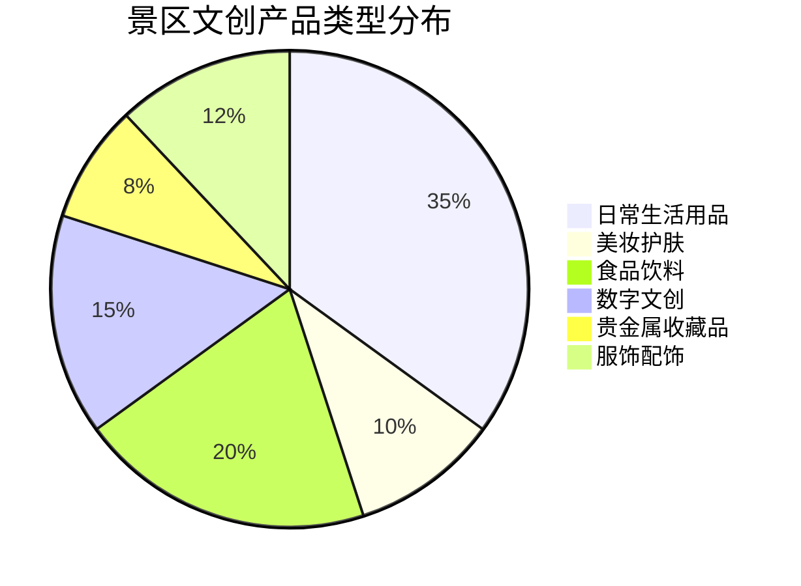
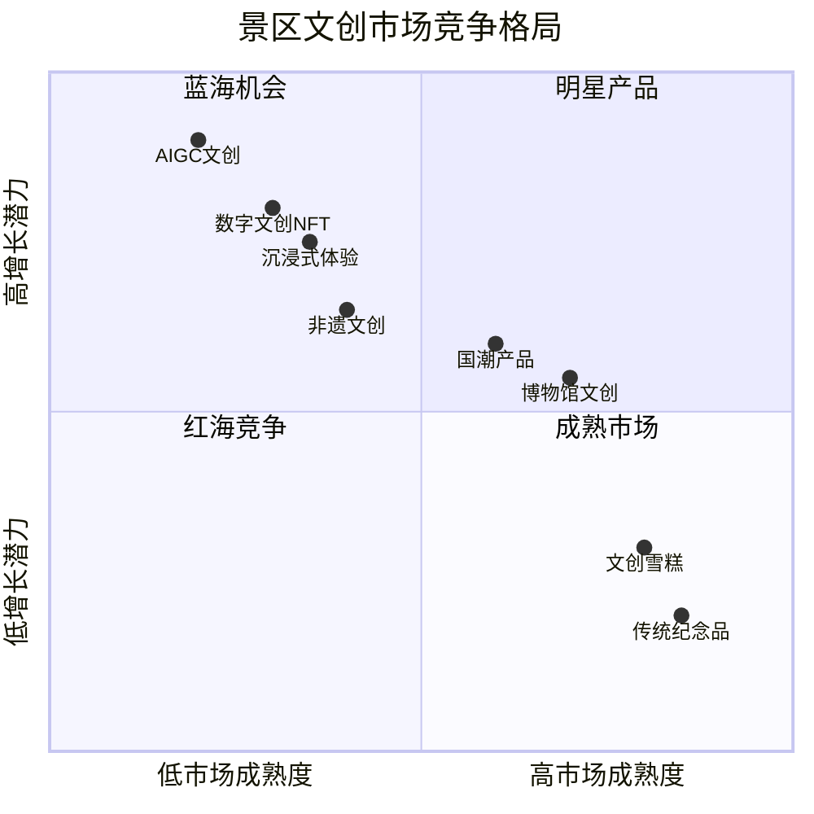
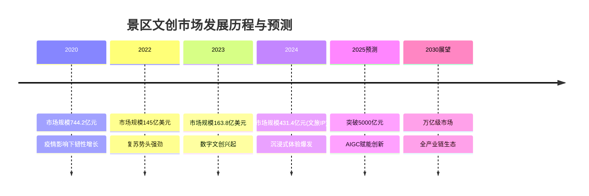
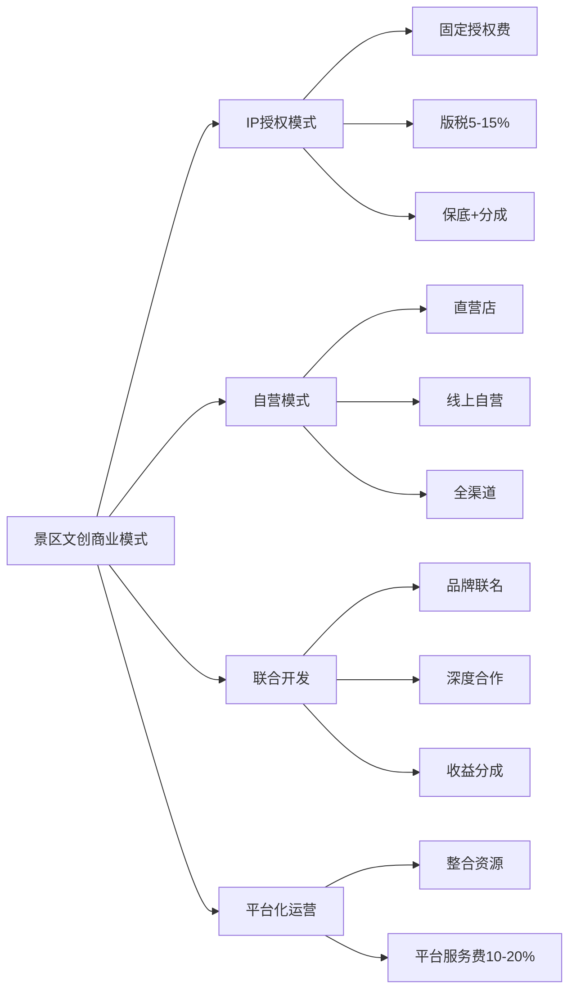

# 中国大陆景区文创市场研究报告

## 执行摘要

中国大陆景区文创市场正处于快速发展期，2024年文旅IP商业化市场规模达431.4亿元，预计2025年将突破5,000亿元。市场呈现从传统纪念品红海向数字文创、沉浸式体验等蓝海领域转型的趋势。本报告通过深入研究景区规模、产品类型、市场渗透率、增长趋势、竞争格局和商业模式，为市场参与者提供全面的行业洞察。

## 研究背景与目的

本研究旨在全面分析中国大陆景区文创市场的现状与发展趋势，重点关注：
- 景区数量、类型和分布情况
- 文创产品类型和市场规模
- 市场渗透率和增长潜力
- 蓝海与红海市场识别
- 细分赛道和商业模式创新

## 关键发现

### 市场规模与增长

根据[文化和旅游部2024年统计数据](https://zwgk.mct.gov.cn/zfxxgkml/tjxx/202505/t20250530_960335.html)：

1. **景区基础**
   - 全国A级景区16,541个（2024年）
   - 年接待游客67.6亿人次
   - 总收入4,814.2亿元

2. **市场增长**
   - 2024年文旅IP商业化市场规模431.4亿元
   - 中国文创产品市场年均增长率13-17%
   - 预计2025年突破5,000亿元

3. **渗透率提升**
   - 5A景区夜间开放率从23%（2020年）提升至63%（2024年）
   - 文创产品占景区二次消费约24.1%
   - 年轻消费群体成为主力军

### 产品类型与创新

景区文创产品体系日益丰富，主要包括：



### 市场竞争格局



## 详细分析

### 一、景区基础与分类

中国大陆景区体系完善，为文创产品发展提供了坚实基础：

- **规模庞大**：16,541个A级景区覆盖全国
- **类型丰富**：自然风景、人文历史、主题公园、度假区等
- **持续增长**：年增长率5.2%，新业态不断涌现

详细分析请参阅：[景区数量、分类和分布概况](./reports/task-1-scenic-area-overview.md)

### 二、文创产品市场分析

市场呈现多元化发展态势：

```mermaid
xychart-beta
    title "中国文创产品市场规模增长趋势（亿美元）"
    x-axis [2020, 2021, 2022, 2023, 2024预测]
    y-axis "市场规模" 0 --> 200
    bar [108, 125, 145, 164, 180]
    line [108, 125, 145, 164, 180]
```

**核心洞察**：
- 故宫、敦煌、三星堆等头部IP年营收超亿元
- 产品从单一纪念品向生活化、艺术化、科技化转型
- IP授权和联名合作成为主流商业模式

详细分析请参阅：[文创产品类型和市场规模分析](./reports/task-2-cultural-creative-products.md)

### 三、市场渗透与增长潜力



详细分析请参阅：[市场渗透率和增长趋势研究](./reports/task-3-market-penetration-growth.md)

### 四、蓝海与红海识别

#### 红海市场（避免过度竞争）
1. **传统纪念品**：钥匙扣、冰箱贴等，毛利率<20%
2. **文创雪糕**：200+景区推出，创意枯竭
3. **低端服饰**：简单logo印制，缺乏文化深度

#### 蓝海机会（重点布局方向）
1. **数字文创/NFT**：区块链技术保证稀缺性，年轻用户接受度高
2. **AIGC赋能**：2025年预计超1,000亿元市场
3. **沉浸式体验**：技术门槛高，客单价高，复购率强
4. **非遗活化**：政策支持大，文化价值高，溢价能力强

详细分析请参阅：[蓝海与红海市场分析](./reports/task-4-blue-ocean-red-ocean.md)

### 五、商业模式与细分赛道



**重点赛道**：
1. **国潮文创**：洛阳汉服2024年产业规模88亿元
2. **非遗文创**：产品溢价30-50%
3. **数字文创**：2024年交易额超50亿元
4. **沉浸式体验**：投资大但回报高

详细分析请参阅：[细分赛道和商业模式研究](./reports/task-5-business-models.md)

## 市场机会与建议

### 投资机会识别

```mermaid
radar
    title 细分市场投资价值评估
    caption (分值0-5：投资价值越高)
    "数字文创": [4.5, 4, 5, 3.5, 4.5]
    "国潮文创": [4, 4.5, 3.5, 4, 3.5]
    "非遗文创": [3.5, 3, 4.5, 4.5, 4]
    "传统纪念品": [2, 2.5, 2, 3, 2]
    ["增长潜力", "利润空间", "技术壁垒", "政策支持", "市场需求"]
```

### 战略建议

#### 对景区运营方
1. **产品策略**：从单一纪念品向全品类文创生态转型
2. **技术应用**：积极拥抱AIGC、AR/VR等新技术
3. **IP建设**：强化自有IP开发和运营能力
4. **渠道布局**：构建线上线下一体化销售网络

#### 对投资者
1. **重点领域**：关注数字文创、AIGC应用、沉浸式体验
2. **投资时机**：蓝海市场窗口期约2-3年
3. **风险控制**：避免过度投资红海领域

#### 对创业者
1. **差异化定位**：寻找细分市场和特定人群
2. **技术创新**：利用新技术降低进入门槛
3. **合作模式**：优先考虑轻资产的IP授权和联名合作

## 未来展望

### 2025-2030年发展预测

1. **市场规模**：2030年文旅综合体市场可能超过3万亿元
2. **技术驱动**：AIGC文创10年内有望达到万亿级规模
3. **消费升级**：从产品消费向体验消费、情感消费转变
4. **国际化**：中国文创IP走向全球市场

### 关键趋势

- **数字化转型加速**：元宇宙、Web3.0概念融入
- **可持续发展**：环保材料和循环经济模式
- **社交化运营**：UGC内容和社群经济
- **产业链整合**：文创+文旅+文娱深度融合

## 结论

中国大陆景区文创市场正处于转型升级的关键期。传统产品面临激烈竞争，而数字文创、AIGC应用、沉浸式体验等新兴领域展现出巨大潜力。成功的关键在于：
- 准确识别蓝海机会
- 创新商业模式
- 深耕文化内涵
- 拥抱技术变革

随着消费升级、政策支持和技术进步，预计未来5-10年中国景区文创市场将迎来黄金发展期，为各类市场参与者提供丰富的价值创造机会。

---

## 研究报告索引

1. [景区数量、分类和分布概况](./reports/task-1-scenic-area-overview.md)
2. [景区文创产品类型和市场规模分析](./reports/task-2-cultural-creative-products.md)
3. [市场渗透率和增长趋势研究](./reports/task-3-market-penetration-growth.md)
4. [蓝海与红海市场分析](./reports/task-4-blue-ocean-red-ocean.md)
5. [细分赛道和商业模式研究](./reports/task-5-business-models.md)

## 数据来源

本报告基于文化和旅游部、中国旅游研究院、智研咨询、观研报告网等权威机构的公开数据和研究报告编制。所有数据均标注来源，确保信息的准确性和可追溯性。