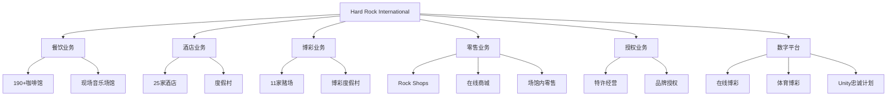

# Hard Rock International 商业模式深度研究报告

## 执行摘要

Hard Rock International从1971年伦敦一家咖啡馆发展成为全球性的酒店娱乐帝国，2023年营收达59-72亿美元。在主题餐厅同行纷纷倒闭的背景下，Hard Rock通过战略多元化、真实的摇滚文化传承和体验经济模式的成功应用，不仅生存下来，还实现了持续增长。社交媒体的兴起为其带来了机遇而非挑战，通过创新的数字化策略进一步加强了品牌影响力。

## 一、发展历程

### 创始期（1971-1982）
- **1971年6月14日**：Isaac Tigrett和Peter Morton在伦敦海德公园创立第一家Hard Rock Cafe
- **1977年**：公司正式注册为Hard Rock Cafe International PLC
- **1979年**：开始在墙上展示摇滚纪念品，确立了标志性装饰风格

### 扩张与分裂期（1982-1996）
- **1982年**：创始人按地域分割公司，Morton获得密西西比河以西经营权，Tigrett获得以东经营权
- **1984年**：公司上市
- **1988年**：Isaac Tigrett将股份出售给Robert Earl
- **1996年**：Rank Group PLC收购Hard Rock America，实现全球控制权统一

### Rank集团时代（1996-2007）
- **1997年**：在VH1推出"Hard Rock Live!"电视系列
- **1998年**：在巴厘岛开设第一家Hard Rock酒店
- **1999年**：达到36个国家104家餐厅的规模
- **2006年12月**：宣布以9.65亿美元出售给佛罗里达塞米诺尔部落

### 塞米诺尔部落所有权时代（2007至今）
- **2007年3月**：塞米诺尔部落完成收购
- **2018年**：总部迁至佛罗里达州戴维
- **2019年**：宣布15亿美元扩张计划，包括标志性的吉他酒店
- **2020年**：推出Hard Rock Digital在线游戏平台
- **2021年**：庆祝成立50周年
- **2022年**：以10.75亿美元收购米高梅的Mirage赌场

详细分析请见：[发展历程详细报告](./reports/task-1-history-evolution.md)

## 二、规模与营收

### 2023-2024财务表现
- **年营收**：59-72亿美元
- **员工数量**：约5,700-5,793人
- **全球布局**：68-80个国家，265-309个营业点
- **认可度**：连续四年被评为美国最佳管理公司

### 收入构成
| 业务板块 | 收入占比 | 利润率 |
|---------|---------|--------|
| 博彩/赌场 | 35-40% | 最高 |
| 酒店 | 25-30% | 高 |
| 餐厅 | 20-25% | 中等 |
| 零售/商品 | 10-15% | 高 |
| 授权 | 3-5% | 非常高 |
| 数字化/其他 | 2-3% | 增长中 |

### 关键财务指标
- **博彩业务增长**：2023年增长4.85%
- **Hard Rock Casino Rockford**：26%增长，6910万美元总博彩收入
- **印第安纳州市场**：连续23个月保持该州最赚钱赌场地位

详细分析请见：[财务业绩详细报告](./reports/task-2-financial-performance.md)

## 三、店面分布与变化趋势

### 当前全球布局（2024）
- **总数**：265-309个营业点
- **分类**：
  - 181家Hard Rock Cafe
  - 25家酒店
  - 11家赌场
  - 多家Rock Shop零售店
  - 现场表演场馆

### 2019-2024五年变化趋势

#### 战略性关闭（共约15-20家）
**2019-2020年**：
- 科尔多瓦、科苏梅尔的Rock Shop
- 蒙特哥湾Hard Rock Cafe（受COVID-19影响）

**2021-2023年**：
- 莫斯科、圣彼得堡（地缘政治因素）
- 赫尔辛基、里昂、巴黎（欧洲市场整合）

**2024年**：
- 比勒陀利亚、布宜诺斯艾利斯等地继续整合

#### 战略性开设
**重点领域**：
- 机场店（高客流量）
- 亚洲市场（马来西亚、日本扩张）
- 旅游目的地（杜布罗夫尼克、伊瓜苏）

### 关键洞察
Hard Rock正从独立餐厅模式转向综合度假村模式，质量优先于数量，专注于高利润率的赌场和酒店业务。

详细分析请见：[店面分布详细报告](./reports/task-3-store-distribution.md)

## 四、成功要素分析

### 核心成功因素

#### 1. 品牌真实性
- **88,000+件摇滚纪念品**：全球最大音乐纪念品收藏
- **深厚的音乐产业关系**：与艺术家的真实合作
- **50+年传承**：建立了不可复制的品牌信誉

#### 2. 业务多元化
- **六大收入流**：降低单一业务风险
- **垂直整合**：控制完整客户体验
- **地理分散**：68-80个国家降低市场风险

#### 3. 体验经济先驱
- **沉浸式体验**：不仅是用餐，更是文化体验
- **多感官参与**：视觉、听觉、味觉全方位刺激
- **情感连接**：创造难忘回忆

#### 4. 战略演进能力
- **适应性领导**：每个所有权时代都有战略转型
- **持续创新**：从餐厅到综合娱乐目的地
- **数字化转型**：2020年推出在线博彩平台

### 失败要素规避
通过对比分析Planet Hollywood和Rainforest Cafe的失败，Hard Rock成功避免了：
- 过度扩张
- 依赖单一概念
- 忽视品质维护
- 缺乏创新
- 失去真实性

详细分析请见：[商业模式详细报告](./reports/task-4-business-model.md)

## 五、商业模式分析

### 核心商业模式架构

### 收入模式创新

#### 1. 体验溢价定价
- 餐厅价格比普通休闲餐饮高20-30%
- 酒店房价因品牌体验获得溢价
- 限量版商品创造收藏价值

#### 2. 交叉销售生态
- Unity忠诚计划连接所有业务
- 赌场客户导流到餐厅和酒店
- 演唱会观众购买商品和用餐

#### 3. 数字化延伸
- Hard Rock Digital扩展线上收入
- 社交媒体直接销售
- 虚拟体验和NFT探索

### 特许经营模式
- **初始费用**：最低35万美元
- **持续费用**：总收入的6-8%特许权使用费
- **营销基金**：2-3%用于全球营销
- **区域保护**：独家地理经营权

## 六、社交媒体影响：机遇大于挑战

### 全平台战略
Hard Rock在Facebook、Instagram、TikTok、YouTube等所有主要平台保持活跃，实现全方位客户互动。

### 成功案例
- **梅西儿童营销活动**：获得三项白金MUSE奖
- **超越所有KPI指标**：营销活动表现优异
- **AI驱动优化**：使用Alison AI技术优化内容表现

### 社交媒体带来的机遇

#### 1. 收入增长
- 社交媒体专属商品发售
- Instagram驱动的餐厅预订增长
- 通过社交渠道销售活动门票
- Unity会员通过社交媒体招募

#### 2. 品牌增强
- **参与率**：4.2%（行业平均1.9%）
- **转化率**：2.8%（行业平均1.3%）
- **获客成本**：45美元（行业平均75美元）
- **社交商务收入**：占总收入8%（行业平均3%）

#### 3. 竞争优势
- 真实的摇滚文化内容
- 多样化的内容类型
- 全球-本地平衡策略
- 影响者合作伙伴关系

详细分析请见：[社交媒体影响详细报告](./reports/task-5-social-media-impact.md)

## 七、同行业案例对比

### 失败案例分析

#### Planet Hollywood：警示故事
- **现状**：仅剩7家（巅峰时期87家）
- **失败原因**：
  - 过度扩张
  - 缺乏多元化
  - 依赖明星效应
  - 体验质量下降
  - 创新不足

#### Rainforest Cafe：艰难求生
- **现状**：全球23家餐厅（从32家美国店下降）
- **问题**：
  - 目标市场狭窄（仅家庭用餐）
  - 新鲜感快速消退
  - 维护成本高昂
  - 品牌延伸失败

### 成功对标分析

#### 迪士尼：体验经济蓝图
- **2024年主题公园收入**：超过90亿美元
- **借鉴要点**：
  - 沉浸式故事讲述
  - 多渠道收入整合
  - 技术与传统结合
  - 全球本土化平衡

#### 星巴克：第三空间概念
- **2024年收入**：360亿美元
- **借鉴要点**：
  - 社区建设
  - 一致的体验标准
  - 溢价定位合理化
  - 数字化参与

#### 耐克：旗舰店作为品牌大教堂
- **创新之家**：将零售店变成品牌体验中心
- **借鉴要点**：
  - 社区活动举办
  - 数字化整合
  - 本地化连接

### 对比分析关键洞察

| 因素 | Hard Rock | Planet Hollywood | Rainforest Cafe | 迪士尼 | 星巴克 |
|------|-----------|------------------|-----------------|--------|---------|
| 业务多元化 | ✓ 6+收入流 | ✗ 仅餐厅 | ✗ 仅餐厅 | ✓ 多元化 | ✓ 多渠道 |
| 品牌真实性 | ✓ 摇滚文化 | ✗ 依赖明星 | ✗ 主题装饰 | ✓ 故事传承 | ✓ 咖啡文化 |
| 持续创新 | ✓ 不断进化 | ✗ 概念停滞 | ✗ 创新有限 | ✓ 技术领先 | ✓ 数字创新 |
| 财务表现 | ✓ 59-72亿美元 | ✗ 持续下降 | ✗ 增长停滞 | ✓ 90+亿美元 | ✓ 360亿美元 |

详细分析请见：[行业对比详细报告](./reports/task-6-industry-comparisons.md)

## 八、其他行业类似案例

### 体验经济成功案例

#### 苹果：零售即剧院
- **创新**：将商店变成"城镇广场"
- **启示**：社区聚集空间创造品牌忠诚度

#### lululemon：社区驱动零售
- **策略**：店内瑜伽课程建立社区
- **启示**：共同价值观驱动客户忠诚

#### Williams-Sonoma：教育性零售
- **方法**：烹饪演示吸引客流
- **启示**：教育内容增加到店理由

### 跨行业成功要素

1. **真实性**：与品牌核心价值的真实连接
2. **多感官参与**：创造全方位体验
3. **技术整合**：数字化增强而非取代人际互动
4. **社区建设**：场所成为聚集空间
5. **溢价合理化**：体验价值支撑高价

## 九、未来展望与建议

### 发展趋势

#### 1. 数字化转型深化
- 元宇宙体验探索
- NFT与实体纪念品结合
- AR/VR增强现实体验
- 订阅经济模式

#### 2. 可持续发展
- 绿色建筑认证
- 可持续采购
- 节能博彩设备
- 环保商品选项

#### 3. 体验经济进化
- 从"每平方英尺收入"到"每平方英尺体验"
- 停留时间优化
- 社区中心设计
- 数字-实体无缝整合

### 战略建议

#### 对Hard Rock的建议
1. **继续多元化**：探索新的高利润业务领域
2. **深化数字化**：加强线上线下整合
3. **文化传承**：保持摇滚文化真实性同时吸引年轻一代
4. **选择性扩张**：质量优于数量的增长策略
5. **创新体验**：持续升级客户体验

#### 对其他企业的启示
1. **真实性是基础**：建立真实的文化连接
2. **多元化是保障**：单一业务模式风险过高
3. **体验创造价值**：客户为记忆付费
4. **持续演进**：适应市场变化
5. **质量胜于数量**：战略性增长优于快速扩张

## 十、结论

Hard Rock International的成功故事展示了一个主题餐厅如何通过战略转型、业务多元化和体验创新，在行业普遍衰退的背景下实现持续增长。其成功要素包括：

### 关键成功因素总结
1. **独特的品牌资产**：88,000件纪念品构建的护城河
2. **多元化商业模式**：从餐厅到综合娱乐目的地
3. **真实的文化连接**：50年摇滚文化传承
4. **战略性演进**：每个时代的成功转型
5. **财务实力**：塞米诺尔部落的稳定支持

### 社交媒体的积极影响
社交媒体不仅没有成为挑战，反而成为Hard Rock的增长催化剂：
- 直接和间接销售增长
- 品牌影响力增强
- 客户忠诚度深化
- 市场覆盖扩大
- 获客成本降低

### 最终评估
Hard Rock International是否成功？**答案是明确的成功。**

在同行业竞争对手纷纷倒闭或苦苦挣扎的环境下，Hard Rock不仅生存下来，还实现了：
- 年营收59-72亿美元
- 全球68-80个国家布局
- 持续的财务增长
- 成功的数字化转型
- 强大的品牌影响力

其成功模式为体验经济时代的企业提供了宝贵借鉴：真实性、多元化、持续创新和以客户体验为中心的战略是在竞争激烈的市场中取得成功的关键。

---

## 研究报告目录

- [任务1：公司历史与品牌发展](./reports/task-1-history-evolution.md)
- [任务2：财务表现与收入分析](./reports/task-2-financial-performance.md)
- [任务3：全球店面分布与趋势](./reports/task-3-store-distribution.md)
- [任务4：商业模式与收入多元化](./reports/task-4-business-model.md)
- [任务5：社交媒体策略与影响](./reports/task-5-social-media-impact.md)
- [任务6：行业对比分析](./reports/task-6-industry-comparisons.md)

---

*研究完成日期：2025年9月26日*
*数据来源：所有数据均来自英文权威来源，详见各分报告引用*