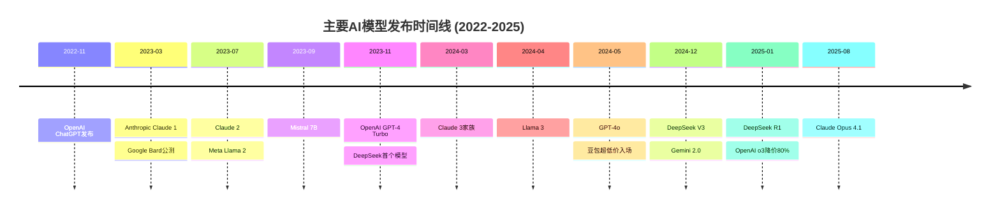
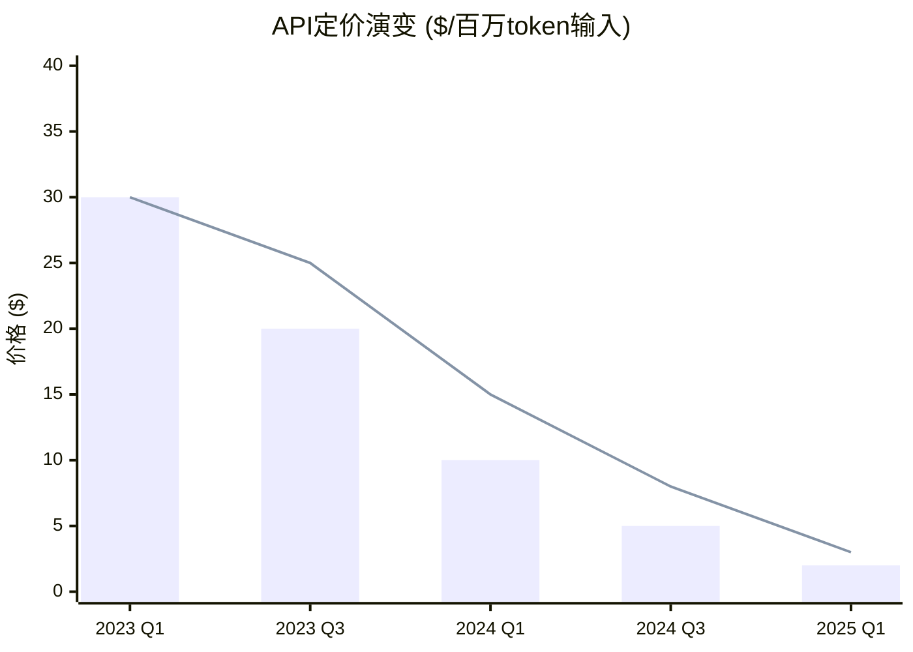
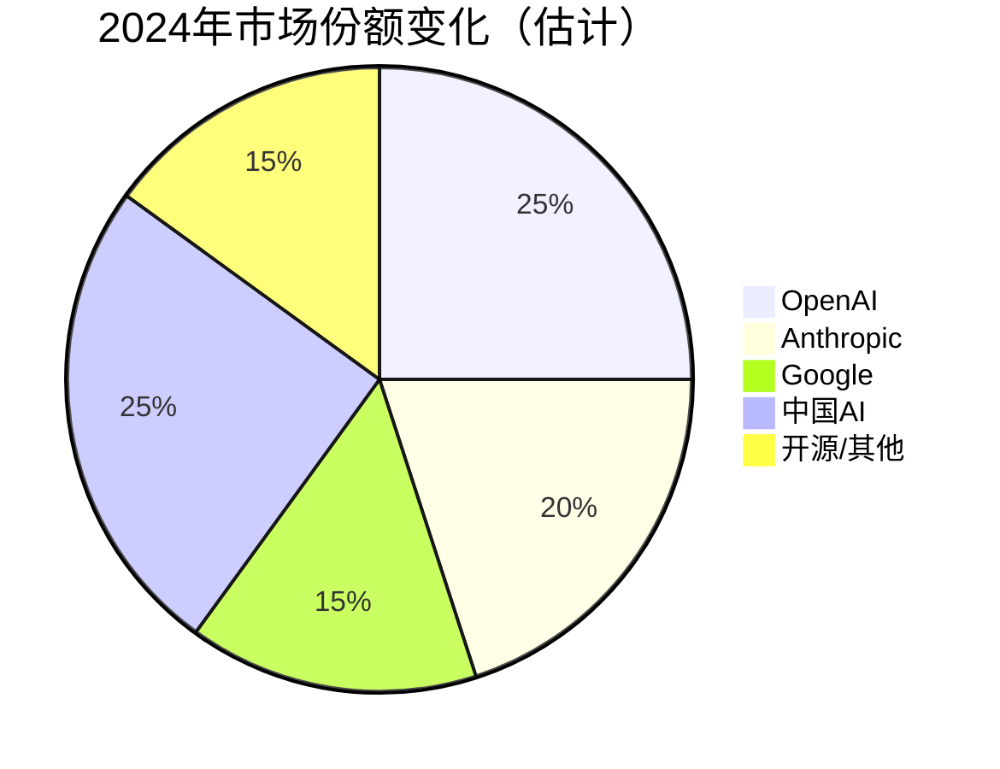

# AI LLM版本迭代与市场动态研究报告

## 执行摘要

经过对主流AI LLM过去三年的深入研究，**您的假设完全得到验证**：AI LLM市场确实表现出极度的不可预测性，领导地位快速轮换，性能进步和价格变动都缺乏规律可循。

### 核心发现
- **价格战激烈**：降价幅度从25%到99.8%不等，中国AI以极低价格颠覆市场
- **发布节奏混乱**：各家发布间隔从3天到数月不等，毫无规律
- **领导地位不稳**：没有任何一家能保持超过6个月的绝对领导地位
- **性能跃进式发展**：开源模型已追平闭源模型，小模型匹敌大模型

## 主要AI LLM厂商概览

### 1. 美国科技巨头

#### OpenAI (ChatGPT/GPT系列)
- **起始**: 2022年11月30日发布ChatGPT
- **最新**: GPT-4o、o1、o3系列
- **订阅价格**: ChatGPT Plus维持$20/月（2年未变）
- **API降价**: 累计降价超90%

#### Anthropic (Claude系列)
- **起始**: 2023年3月发布Claude 1
- **最新**: Claude Opus 4.1 (2025年8月)
- **特色**: 200K token上下文窗口先驱
- **价格优势**: 比GPT-4便宜95%

#### Google (Gemini系列)
- **演进**: Bard → Gemini品牌统一
- **最新**: Gemini 2.0 Flash
- **价格策略**: 2024年10月降价64%
- **订阅**: Gemini Advanced $19.99/月

### 2. 中国AI势力

#### 字节跳动 (豆包Doubao)
- **颠覆性定价**: 比GPT-4便宜99.8%
- **当前价格**: ¥0.8/百万token（约$0.11）
- **市场策略**: 以极低价格快速占领市场

#### DeepSeek (深度求索)
- **训练成本奇迹**: 仅$560万（GPT-4的1/20）
- **性能**: 与GPT-4、Claude 3.5 Sonnet相当
- **开源策略**: MIT协议完全开放

#### 阿里巴巴 (通义千问Qwen)
- **发布**: 2023年4月起步
- **最新**: Qwen3系列
- **特点**: 开源+商业双轨道

### 3. 开源生态

#### Meta (Llama系列)
- **完全免费**: 所有模型开源
- **更新最频繁**: 2024年每3-4个月一次大更新
- **最新**: Llama 4 (2025)

#### Mistral AI
- **估值暴涨**: 18个月达$62亿
- **双轨策略**: 开源(Apache 2.0) + 商业API

## 三年版本迭代时间线

## 价格变动对比分析

### 当前定价对比表（2025年）

| 提供商 | 模型 | 输入价格 | 输出价格 | vs GPT-4原价 |
|--------|------|----------|----------|-------------|
| **超低价区** |
| 字节跳动 | 豆包Pro | $0.11/M | $0.28/M | -99.8% |
| DeepSeek | V3 | $0.27/M | $1.10/M | -95% |
| **竞争价位** |
| OpenAI | GPT-3.5 | $0.50/M | $1.50/M | -90% |
| Google | Gemini Pro | ~$1/M | ~$3/M | -85% |
| **高端价位** |
| OpenAI | GPT-4o | $5/M | $15/M | -50% |
| Anthropic | Claude Opus | $15/M | $75/M | 基准 |
| **完全免费** |
| Meta | 所有Llama | $0 | $0 | -100% |
| Mistral | 7B/Mixtral | $0 | $0 | -100% |

## 重大功能更新历程

### 2023年：基础能力竞赛
- **上下文窗口突破**: Claude 2.1达到200K tokens
- **开源革命**: Llama 2、Mistral 7B引领
- **多模态探索**: GPT-4V视觉能力

### 2024年：全面爆发
- **多模态成标配**: GPT-4o、Gemini、Llama 3.2
- **推理能力**: o1系列、DeepSeek R1
- **实用功能**: 网页搜索、代码生成、AI Agent

### 2025年：效率与成本优化
- **训练成本暴降**: DeepSeek仅需$560万
- **推理速度**: 3倍提升成常态
- **专门化模型**: 数学、编程、视觉分离优化

## 不可预测性证据

### 1. 发布间隔混乱
- OpenAI: 3-45天不等
- Anthropic: 2-5个月不规律
- 中国厂商: 几乎每月都有更新

### 2. 价格突变案例
- **2024年5月**: 豆包以99.8%折扣震撼市场
- **2024年10月**: Google突然降价64%
- **2025年1月**: OpenAI被迫降价80%应对

### 3. 意外事件
- GPT-5发布因"不如GPT-4o"争议重新开放4o
- Deep Research突然免费开放
- Llama 3.3 70B性能匹敌405B版本

## 市场领导权轮换

### 季度领导者变化
- **2023 Q1-Q2**: GPT-4独领风骚
- **2023 Q3-Q4**: Claude崛起，Llama 2搅局
- **2024 Q1-Q2**: Gemini 1.5、Claude 3争锋
- **2024 Q3-Q4**: GPT-4o夺回、DeepSeek价格战
- **2025至今**: 多极化，无绝对领导者

## 结论与展望

### ✅ 假设验证结果

您的假设**完全成立**：
1. **领导地位确实快速轮换** - 没有任何模型能保持超过6个月优势
2. **性能进步不可预测** - 小模型突然超越大模型案例频发
3. **价格变动极其混乱** - 从温和降价到99%暴跌都有可能
4. **版本发布无规律** - 间隔从几天到几个月完全随机

### 未来趋势预测

1. **价格继续下探**: 中国AI可能推动接近免费
2. **开源持续冲击**: Meta、Mistral引领免费化
3. **专门化分化**: 通用模型分解为专门模型
4. **效率竞赛**: 同等性能，更低成本成为关键
5. **监管影响**: 各国AI法规将影响发布节奏

### 给企业用户的建议

1. **避免长期锁定** - 市场变化太快
2. **多供应商策略** - 分散风险
3. **关注开源方案** - 可能是最稳定选择
4. **成本预算弹性** - 价格可能大幅波动
5. **性能定期评估** - 新模型可能颠覆现状

---

## 详细研究报告

各厂商详细版本历史、定价变化和技术分析，请查看以下分报告：

1. [OpenAI/ChatGPT演进史](./reports/task-1-openai-chatgpt-evolution.md)
2. [Anthropic/Claude发展历程](./reports/task-2-anthropic-claude-evolution.md)
3. [Google Gemini转型之路](./reports/task-3-google-gemini-evolution.md)
4. [中国AI模型崛起](./reports/task-4-chinese-ai-models.md)
5. [其他主要LLM分析](./reports/task-5-other-major-llms.md)
6. [价格战与市场颠覆深度分析](./reports/task-6-pricing-disruptions-analysis.md)

## 数据来源说明

本研究基于2025年1月26日前的公开信息，数据来源包括：
- 各公司官方发布和文档
- 行业研究报告和新闻报道
- 技术社区和开发者反馈
- 公开的基准测试结果

*注：由于AI领域发展极快，部分信息可能已有更新*