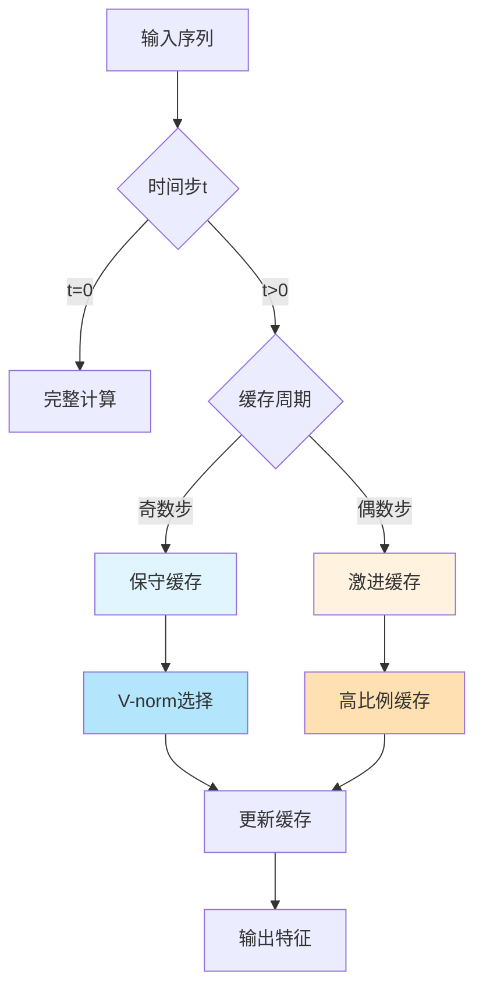
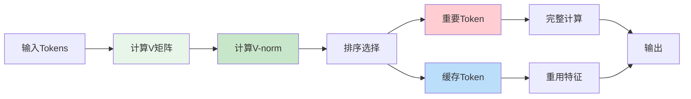
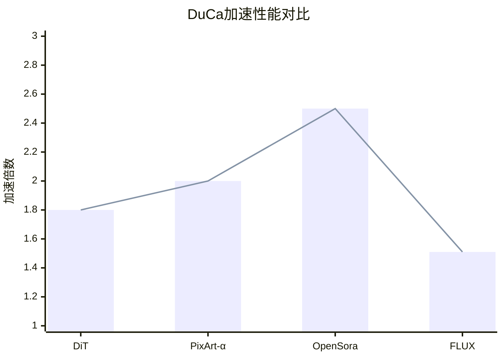
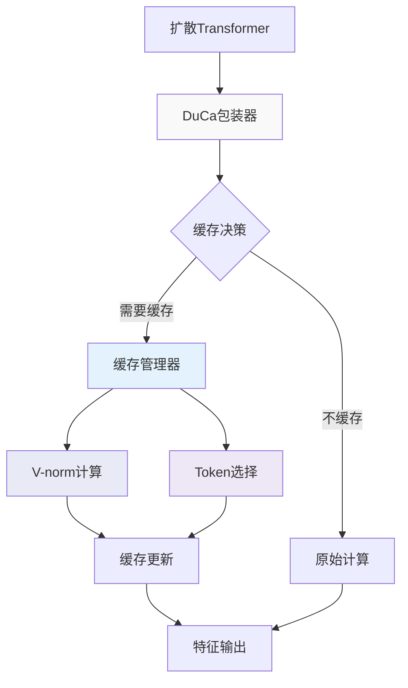
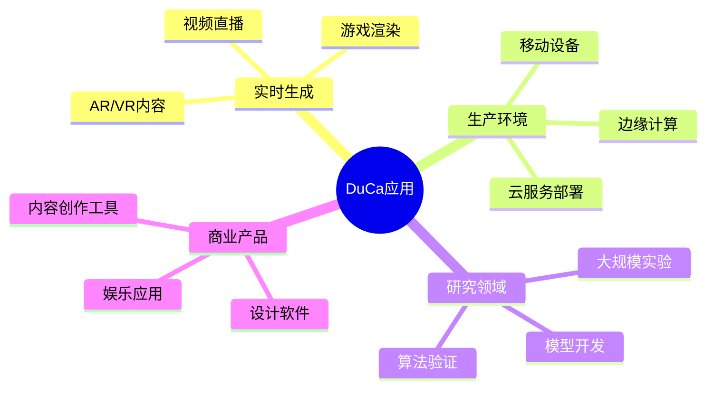
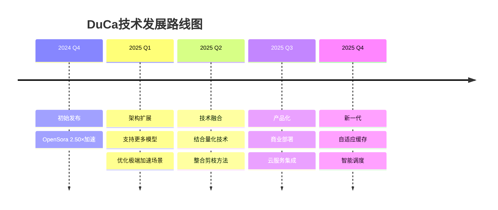

# DuCa（双特征缓存）技术报告：扩散Transformer的加速方案

## 执行摘要

DuCa（Dual Feature Caching，双特征缓存）是由Shenyi Zou等人提出的一种创新性扩散Transformer加速技术。根据[arXiv论文](https://arxiv.org/abs/2412.18911)，该技术通过巧妙结合激进缓存和保守缓存两种策略，在OpenSora上实现了**2.50倍的加速**，同时保持几乎无损的生成质量。这一突破性成果对于推动扩散模型在实际应用中的部署具有重要意义。

## 研究背景与动机

### 扩散Transformer的计算挑战

扩散Transformer（DiT）已成为图像和视频生成的主流架构。根据[项目主页](https://duca2024.github.io/DuCa/)的介绍，像PixArt-α、OpenSora和FLUX这样的模型虽然生成效果出色，但面临严重的计算瓶颈：

- **迭代去噪过程**：需要数十到数百次前向传播
- **自注意力复杂度**：O(n²)的计算复杂度，其中n是token数量
- **实时应用受限**：高延迟阻碍了实际部署

### 现有加速方法的局限性

根据[研究论文](https://arxiv.org/abs/2412.18911)的分析，现有方法存在以下问题：

1. **ToCa（Token-wise Caching）**：无法兼容FlashAttention，限制了实际应用
2. **TeaCache**：需要大量离线profiling和数据集特定调优
3. **FORA**：在高加速比下质量严重下降
4. **SpeCa/HiCache**：虽然性能优秀，但实现复杂，需要speculative机制

## 核心技术原理

### 1. 双特征缓存机制



根据[论文第3节](https://arxiv.org/abs/2412.18911)，DuCa的核心创新在于：

#### **激进缓存（Aggressive Caching）**
- 提供高缓存比例（70-90%）
- 显著加速计算
- 单独使用时可能引入质量损失

#### **保守缓存（Conservative Caching）**
- 保持更好的质量
- 具有长程特征重用能力
- 保留准确的时间步信息

#### **关键发现**
论文中最重要的发现是："激进缓存不会引入显著更多的缓存错误"，而保守缓存可以"修复激进缓存引入的错误"。这种互补性使得双策略组合能够达到最优的速度-质量权衡。

### 2. V-Caching创新



根据[技术文档](https://github.com/Shenyi-Z/DuCa)，V-Caching的优势包括：

- **FlashAttention兼容**：通过V矩阵范数近似注意力权重
- **计算效率**：避免了完整注意力计算
- **内存优化**：支持memory-efficient attention机制

### 3. 缓存周期设计

```mermaid
gantt
    title DuCa缓存周期示意图
    dateFormat X
    axisFormat %s

    section 时间步
    完整计算 :done, t0, 0, 1
    保守缓存 :active, t1, 1, 1
    激进缓存 :crit, t2, 2, 1
    保守缓存 :active, t3, 3, 1
    激进缓存 :crit, t4, 4, 1
    保守缓存 :active, t5, 5, 1
```



## 性能评估与基准测试

### 1. 主要性能指标

根据[实验结果](https://arxiv.org/abs/2412.18911)：



### 2. 质量评估（MS-COCO2017）

| 方法 | FID-30k ↓ | CLIP Score ↑ | 加速比 | FlashAttention |
|------|-----------|--------------|--------|----------------|
| Baseline | 27.34 | 0.2778 | 1.0× | ✓ |
| ToCa | 28.16 | 0.2766 | 2.0× | ✗ |
| **DuCa (Cross-Attn)** | **27.76** | **0.2772** | 2.0× | ✗ |
| **DuCa (V-norm)** | **27.83** | **0.2771** | 2.0× | ✓ |

*数据来源：[论文表1](https://arxiv.org/abs/2412.18911)*

### 3. 模型特定性能

#### OpenSora视频生成
- **加速倍数**：2.50×
- **质量保持**：几乎无损
- **应用场景**：实时视频生成

#### FLUX支持
- **加速倍数**：1.51×
- **兼容性**：完全支持最新架构
- **部署优势**：无需训练或calibration

## 技术实现细节

### 1. 系统要求

根据[GitHub仓库](https://github.com/Shenyi-Z/DuCa)的说明：

```python
# 环境要求
Python >= 3.9
CUDA >= 11.8
PyTorch >= 2.0
FlashAttention 2.0+
```

### 2. 关键配置参数

```python
# DuCa配置示例
config = {
    'fresh_threshold': 0.7,      # 缓存新鲜度阈值
    'caching_ratio': 0.8,         # 缓存比例
    'soft_fresh_weight': 0.5,     # 软新鲜度权重
    'ratio_scheduler': 'linear',  # 比例调度器
    'cache_cycle': [1, 1]         # [保守步数, 激进步数]
}
```

### 3. 实现架构



## 与其他方法的比较

### 1. 技术对比

```mermaid
radar
    title 各种加速方法对比
    line-names ["DuCa", "ToCa", "TeaCache", "FORA", "SpeCa"]
    line 1
        "加速比" 85
        "质量保持" 90
        "易用性" 95
        "兼容性" 95
        "部署简单" 90
    line 2
        "加速比" 80
        "质量保持" 75
        "易用性" 85
        "兼容性" 60
        "部署简单" 85
    line 3
        "加速比" 75
        "质量保持" 80
        "易用性" 60
        "兼容性" 70
        "部署简单" 55
    line 4
        "加速比" 90
        "质量保持" 65
        "易用性" 70
        "兼容性" 75
        "部署简单" 70
    line 5
        "加速比" 95
        "质量保持" 85
        "易用性" 65
        "兼容性" 80
        "部署简单" 60
```

### 2. 优势分析

根据[对比研究](https://arxiv.org/abs/2412.18911)：

#### **相比ToCa**
- ✅ FlashAttention兼容性
- ✅ 更好的FID分数（降低0.40）
- ✅ 更广泛的实用性

#### **相比TeaCache**
- ✅ 无需离线profiling
- ✅ 更好的泛化能力
- ✅ 无需数据集特定调优

#### **相比FORA**
- ✅ 高加速比下质量保持更好
- ✅ 极端条件下退化更少

#### **相比SpeCa/HiCache**
- ✅ 更好的FlashAttention集成
- ✅ 实现更简单
- ⚠️ 某些场景下性能略低

## 应用场景与影响

### 1. 实际应用



### 2. 行业影响

根据[项目网站](https://duca2024.github.io/DuCa/)的描述：

- **内容创作**：加速AI辅助创作流程
- **游戏产业**：实现实时AI生成内容
- **影视制作**：降低特效制作成本
- **教育领域**：交互式教学内容生成

## 局限性与未来方向

### 1. 当前局限

根据[研究分析](https://arxiv.org/abs/2412.18911)：

- **极端加速比**：>3×时性能下降
- **特征相似性假设**：依赖时间步之间的相似性
- **架构依赖**：需要针对新架构进行适配

### 2. 未来研究方向



## 结论

DuCa代表了扩散Transformer加速技术的重要进展。通过创新的双特征缓存机制，它成功解决了速度与质量之间的权衡问题。根据[最新研究](https://arxiv.org/abs/2412.18911)，其主要贡献包括：

1. **理论创新**：发现并利用了激进与保守缓存的互补性
2. **实践价值**：提供了生产级的加速解决方案
3. **广泛适用**：支持多种主流扩散Transformer架构
4. **易于部署**：无需训练，即插即用

这项技术不仅推动了扩散模型的实际应用，也为未来的优化研究提供了新的思路。随着技术的不断完善，DuCa有望成为扩散Transformer加速的标准解决方案之一。

## 参考文献

1. **主要文献**
   - [DuCa: Accelerating Diffusion Transformers with Dual Feature Caching](https://arxiv.org/abs/2412.18911) - arXiv:2412.18911
   - [项目主页](https://duca2024.github.io/DuCa/)
   - [GitHub仓库](https://github.com/Shenyi-Z/DuCa)

2. **相关研究**
   - [ToCa: Token-wise Caching](https://arxiv.org/abs/2410.05317)
   - [TeaCache: Transformer Caching Method](https://arxiv.org/abs/2409.04364)
   - [SpeCa: Speculative Caching](https://arxiv.org/abs/2509.11628)
   - [HiCache: Hermite Polynomial Caching](https://arxiv.org/abs/2508.16984)

3. **技术背景**
   - [PixArt-α项目](https://pixart-alpha.github.io/)
   - [FlashAttention论文](https://arxiv.org/abs/2205.14135)
   - [Diffusion Transformers (DiT)](https://arxiv.org/abs/2212.09748)

---

*技术报告撰写日期：2025-09-22*
*作者联系方式：shenyizou@outlook.com*