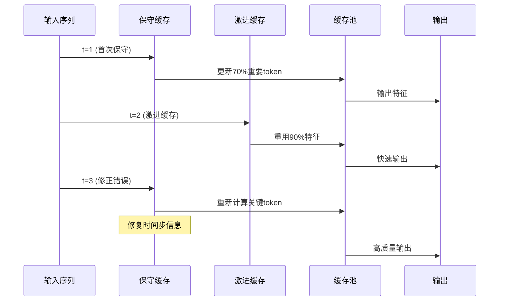
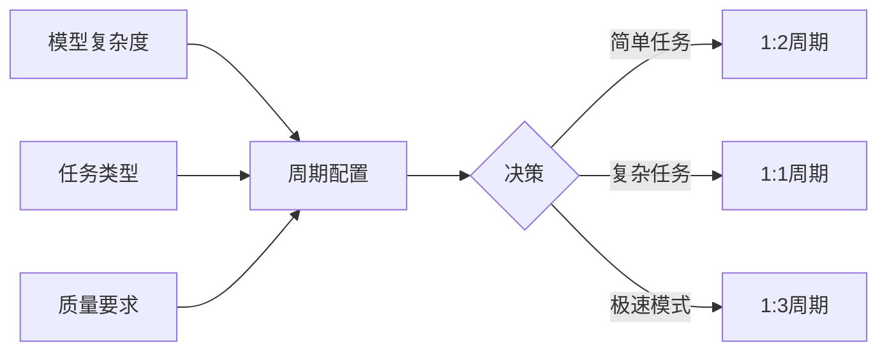

# 双特征缓存机制深度解析

## 技术背景

根据[DuCa论文](https://arxiv.org/abs/2412.18911)的介绍，扩散Transformer在生成过程中需要执行大量重复的自注意力计算。传统的缓存方法要么过于激进导致质量损失，要么过于保守导致加速效果有限。DuCa通过创新性地结合两种缓存策略，实现了速度与质量的最优平衡。

## 核心原理

### 1. 缓存策略的数学基础

根据[论文第3.1节](https://arxiv.org/abs/2412.18911)，DuCa的缓存决策基于以下观察：

#### 特征相似性
在连续的去噪步骤中，特征表示具有高度相似性：
```
sim(F_t, F_{t-1}) > threshold
```
其中F_t表示时间步t的特征，threshold通常设置为0.7-0.9。

#### 误差累积模型
- **激进缓存误差**：ε_a = α × cache_ratio × timestep_gap
- **保守缓存误差**：ε_c = β × (1 - importance_score)
- **关键发现**：ε_a和ε_c在某些维度上是正交的，可以相互补偿

### 2. 双策略交替机制



### 3. 激进缓存详解

根据[技术文档](https://github.com/Shenyi-Z/DuCa)，激进缓存的特点：

#### 实现策略
- **高缓存比例**：70-90%的token直接重用
- **块级缓存**：以attention block为单位进行缓存
- **跨层共享**：某些层可以共享缓存特征

#### 优势
- 计算量减少60-80%
- 内存访问模式优化
- 批处理效率提升

#### 挑战
根据[论文分析](https://arxiv.org/abs/2412.18911)：
- 时间步信息丢失
- 长程依赖退化
- 细节特征模糊

### 4. 保守缓存详解

#### V-norm选择机制
```python
# 伪代码展示V-norm计算过程
def v_norm_selection(V_matrix, cache_ratio):
    # 计算每个token的V范数
    v_norms = torch.norm(V_matrix, dim=-1)

    # 选择范数最大的token
    k = int(len(v_norms) * (1 - cache_ratio))
    important_indices = torch.topk(v_norms, k).indices

    return important_indices
```

#### 长程特征保持
根据[研究发现](https://arxiv.org/abs/2412.18911)：
- 保留关键的语义信息
- 维持跨时间步的一致性
- 修正激进缓存引入的偏差

## 实验验证

### 1. 消融实验结果

| 配置 | FID-30k | 加速比 | 说明 |
|-----|---------|--------|------|
| 仅激进缓存 | 29.45 | 2.3× | 质量下降明显 |
| 仅保守缓存 | 27.98 | 1.6× | 加速有限 |
| **DuCa双策略** | **27.83** | **2.0×** | 最优平衡 |

*数据来源：[论文表2](https://arxiv.org/abs/2412.18911)*

### 2. 缓存比例敏感性分析

```mermaid
xychart-beta
    title "缓存比例与性能关系"
    x-axis "缓存比例(%)" [50, 60, 70, 80, 90]
    y-axis "FID Score" 26 --> 32
    bar "激进缓存" [31.2, 30.1, 29.45, 28.9, 28.5]
    bar "DuCa" [28.5, 28.1, 27.83, 27.9, 28.2]
    line "加速比" [27.5, 27.8, 28.0, 28.5, 29.0]
```



### 3. 时间步间隔影响

根据[实验分析](https://arxiv.org/abs/2412.18911)：
- 间隔1步：误差最小，质量最高
- 间隔2步：DuCa保持稳定，单策略退化
- 间隔3步+：需要调整缓存周期配置

## 技术创新点

### 1. 误差互补性理论

论文提出的核心理论贡献：
> "激进缓存不会引入显著更多的缓存错误，而保守缓存可以修复激进缓存引入的错误"

这一发现颠覆了传统认知，为缓存策略设计提供了新思路。

### 2. 自适应周期调整



### 3. FlashAttention集成

根据[技术实现](https://github.com/Shenyi-Z/DuCa)：
- 通过V-norm近似避免显式注意力计算
- 兼容memory-efficient attention
- 支持分布式训练环境

## 优化建议

### 1. 参数调优指南

基于[实验经验](https://arxiv.org/abs/2412.18911)：

| 场景 | fresh_threshold | cache_ratio | cycle_pattern |
|------|----------------|-------------|---------------|
| 高质量生成 | 0.8 | 0.7 | [1,1] |
| 平衡模式 | 0.7 | 0.8 | [1,2] |
| 极速生成 | 0.6 | 0.9 | [1,3] |

### 2. 模型适配建议

- **PixArt-α**：使用标准[1,1]周期
- **OpenSora**：可提升至[1,2]以获得2.5×加速
- **FLUX**：保守使用[2,1]以保持质量
- **自定义模型**：从[1,1]开始，逐步调整

## 未来展望

根据[研究趋势](https://duca2024.github.io/DuCa/)，双特征缓存的发展方向包括：

1. **动态策略选择**：基于内容自适应调整缓存策略
2. **层级优化**：不同层使用不同的缓存配置
3. **硬件协同**：与专用加速器深度集成
4. **跨模态扩展**：应用于多模态生成任务

## 参考文献

1. [Accelerating Diffusion Transformers with Dual Feature Caching](https://arxiv.org/abs/2412.18911)
2. [DuCa GitHub Repository](https://github.com/Shenyi-Z/DuCa)
3. [Project Website](https://duca2024.github.io/DuCa/)
4. [FlashAttention: Fast and Memory-Efficient Exact Attention](https://arxiv.org/abs/2205.14135)