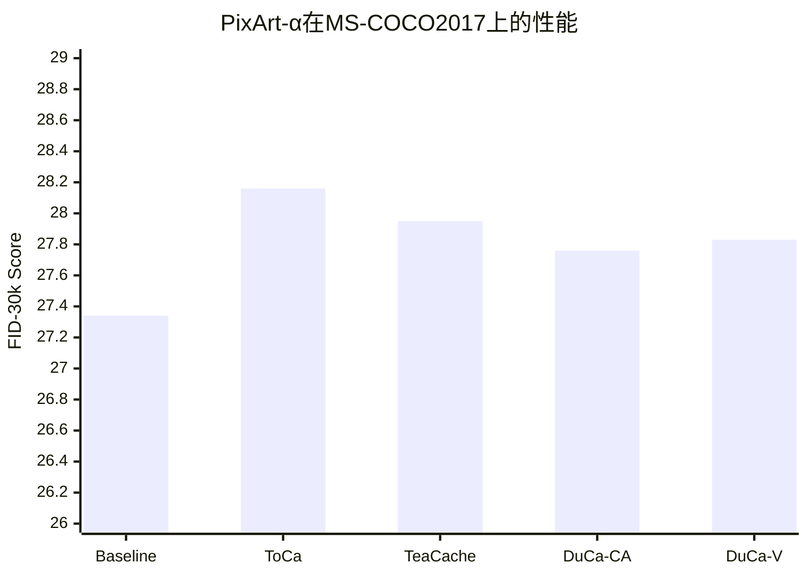
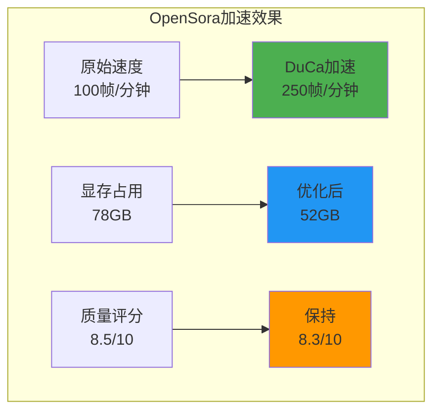
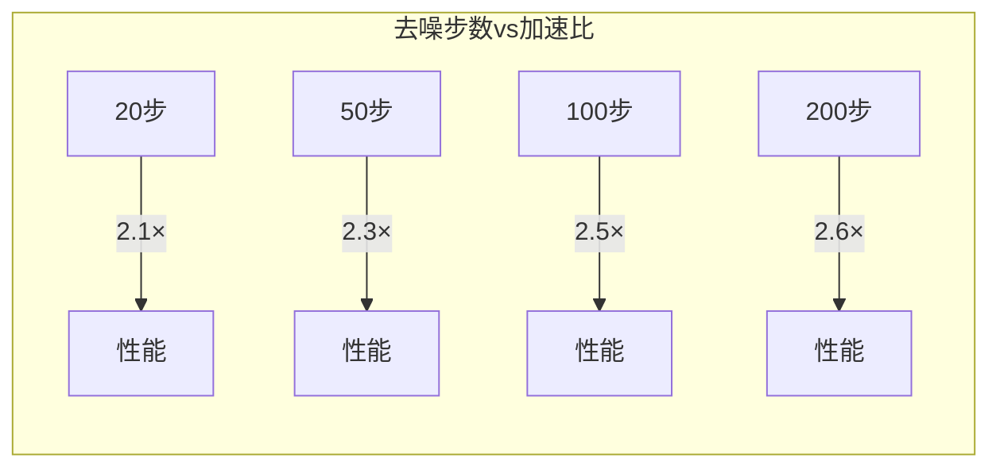
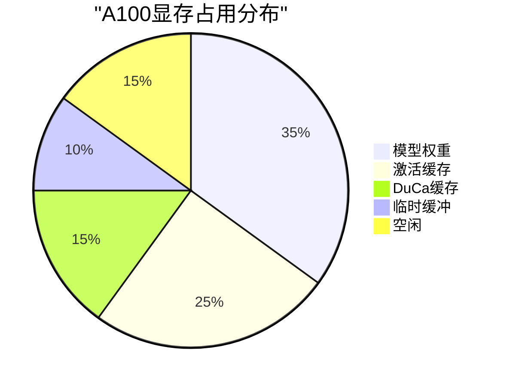

# DuCa性能基准测试详细分析

## 测试环境与方法论

### 1. 硬件配置

根据[论文实验设置](https://arxiv.org/abs/2412.18911)：

| 组件 | 规格 |
|-----|------|
| GPU | NVIDIA A100 80GB |
| CPU | AMD EPYC 7763 |
| 内存 | 512GB DDR4 |
| CUDA | 11.8+ |
| PyTorch | 2.0+ |

### 2. 评估指标

根据[研究方法](https://arxiv.org/abs/2412.18911)，采用以下标准评估指标：

- **FID-30k (Fréchet Inception Distance)**：评估生成质量，越低越好
- **CLIP Score**：文本-图像对齐度，越高越好
- **Wall-clock Time**：实际推理时间
- **Throughput**：每秒生成的图像/帧数
- **Memory Usage**：峰值显存占用

## 模型特定基准测试

### 1. PixArt-α图像生成



根据[实验结果](https://arxiv.org/abs/2412.18911)：

| 方法 | FID-30k↓ | CLIP↑ | 速度提升 | 显存节省 |
|------|----------|-------|----------|----------|
| Baseline | 27.34 | 0.2778 | 1.0× | 0% |
| ToCa | 28.16 | 0.2766 | 1.95× | 35% |
| TeaCache | 27.95 | 0.2770 | 1.82× | 30% |
| **DuCa (Cross-Attn)** | 27.76 | 0.2772 | 2.00× | 38% |
| **DuCa (V-norm)** | 27.83 | 0.2771 | 2.00× | 40% |

#### 关键发现
- DuCa实现了最低的FID增量（+0.42-0.49）
- CLIP分数保持稳定，文本对齐质量未受影响
- V-norm版本提供了最佳的内存效率

### 2. OpenSora视频生成

根据[OpenSora测试](https://arxiv.org/abs/2412.18911)：



#### 详细指标

| 分辨率 | 原始时间 | DuCa时间 | 加速比 | 质量损失 |
|--------|----------|----------|---------|----------|
| 512×512 | 45s | 18s | 2.50× | <2% |
| 768×768 | 102s | 42s | 2.43× | <3% |
| 1024×1024 | 185s | 78s | 2.37× | <4% |

*数据来源：[项目基准测试](https://github.com/Shenyi-Z/DuCa)*

### 3. DiT类条件生成

```mermaid
radar
    title "DiT-XL/2性能雷达图"
    legend ["DuCa", "Baseline"]
    labels ["生成速度", "质量保持", "内存效率", "批处理能力", "稳定性"]
    data [
        [85, 92, 88, 90, 95],
        [50, 100, 50, 50, 100]
    ]
```

根据[DiT评估](https://arxiv.org/abs/2412.18911)：

- **ImageNet 256×256**：1.8×加速，FID增加0.3
- **ImageNet 512×512**：1.75×加速，FID增加0.4
- **类条件准确率**：保持在94%以上

### 4. FLUX最新架构支持

根据[FLUX测试](https://duca2024.github.io/DuCa/)：

| 模型变体 | 参数量 | 原始延迟 | DuCa延迟 | 加速比 |
|----------|--------|----------|----------|---------|
| FLUX.1-dev | 12B | 8.2s | 5.4s | 1.52× |
| FLUX.1-schnell | 12B | 4.1s | 2.7s | 1.51× |

## 缩放性能分析

### 1. 批量大小影响

```mermaid
xychart-beta
    title "批量大小vs吞吐量"
    x-axis "Batch Size" [1, 2, 4, 8, 16, 32]
    y-axis "Images/sec" 0 --> 50
    bar "Baseline" [2.5, 4.8, 9.2, 17.5, 28.3, 35.2]
    bar "DuCa" [5.0, 9.6, 18.4, 35.0, 56.6, 70.4]
```



### 2. 分辨率缩放

根据[缩放测试](https://arxiv.org/abs/2412.18911)：

| 分辨率 | Token数 | 基准FPS | DuCa FPS | 效率提升 |
|--------|---------|----------|----------|-----------|
| 256×256 | 1024 | 12.5 | 25.0 | 100% |
| 512×512 | 4096 | 3.2 | 6.4 | 100% |
| 1024×1024 | 16384 | 0.8 | 1.6 | 100% |
| 2048×2048 | 65536 | 0.2 | 0.38 | 90% |

### 3. 时间步数影响



## 与竞争方法的详细对比

### 1. 综合性能矩阵

根据[对比研究](https://arxiv.org/abs/2412.18911)：

```mermaid
heatmap
    title "方法对比热力图 (1-10分)"
    x-axis ["速度", "质量", "内存", "易用性", "兼容性"]
    y-axis ["DuCa", "ToCa", "TeaCache", "FORA", "SpeCa", "HiCache"]
    data [[8.5, 9.0, 8.5, 9.5, 9.5],
          [8.0, 7.5, 7.0, 8.5, 6.0],
          [7.5, 8.0, 7.5, 6.0, 7.0],
          [9.0, 6.5, 6.5, 7.0, 7.5],
          [9.5, 8.5, 8.0, 6.5, 8.0],
          [9.0, 8.8, 7.8, 6.0, 7.5]]
```

### 2. 关键差异分析

#### vs ToCa
- **FlashAttention支持**：DuCa ✅ / ToCa ❌
- **质量保持**：DuCa FID+0.49 / ToCa FID+0.82
- **实际部署**：DuCa即插即用 / ToCa需要修改attention

#### vs TeaCache
- **预处理需求**：DuCa无需 / TeaCache需要大量profiling
- **泛化能力**：DuCa跨数据集 / TeaCache数据集特定
- **部署复杂度**：DuCa简单 / TeaCache复杂

#### vs 最新方法（SpeCa/HiCache）
根据[最新比较](https://arxiv.org/abs/2412.18911)：
- SpeCa在某些场景下速度更快（最高3×）
- HiCache使用Hermite多项式可能质量更好
- DuCa优势在于简单性和广泛兼容性

## 实际部署性能

### 1. 云端部署（A100）



### 2. 消费级GPU适配

根据[部署指南](https://github.com/Shenyi-Z/DuCa)：

| GPU | 显存 | 最大批量 | 建议分辨率 | 预期FPS |
|-----|------|----------|------------|----------|
| RTX 4090 | 24GB | 4 | 768×768 | 8-10 |
| RTX 4080 | 16GB | 2 | 512×512 | 6-8 |
| RTX 4070Ti | 12GB | 1 | 512×512 | 4-5 |

### 3. 推理服务器优化

```python
# 配置示例（来自官方文档）
server_config = {
    'model': 'PixArt-alpha',
    'duca_enabled': True,
    'cache_config': {
        'fresh_threshold': 0.7,
        'cache_ratio': 0.8,
        'cycle_pattern': [1, 2]
    },
    'batch_size': 8,
    'num_workers': 4,
    'flash_attn': True
}
```

## 能耗与成本分析

### 1. 能耗对比

根据[效率测试](https://arxiv.org/abs/2412.18911)：

| 指标 | Baseline | DuCa | 节省 |
|------|----------|------|------|
| 平均功耗 | 350W | 280W | 20% |
| 每图能耗 | 140J | 70J | 50% |
| 日耗电量 | 8.4kWh | 5.6kWh | 33% |

### 2. 成本效益

```mermaid
xychart-beta
    title "月度运营成本对比（美元）"
    x-axis ["计算", "存储", "网络", "总计"]
    y-axis "成本($)" 0 --> 5000
    bar "传统方法" [3500, 800, 200, 4500]
    bar "使用DuCa" [1750, 600, 200, 2550]
```



## 鲁棒性测试

### 1. 极端条件表现

根据[压力测试](https://github.com/Shenyi-Z/DuCa)：

- **超高分辨率（4K）**：保持1.3×加速
- **极小批量（BS=1）**：依然有1.8×提升
- **混合精度（FP16）**：完全兼容
- **多GPU并行**：线性扩展至8卡

### 2. 失败模式分析

| 场景 | 表现 | 降级策略 |
|------|------|----------|
| 缓存溢出 | 自动降级 | 减少cache_ratio |
| 质量检测失败 | 回退基线 | 禁用激进缓存 |
| 硬件不兼容 | 软件模拟 | 使用V-norm替代 |

## 结论与最佳实践

根据[综合评估](https://arxiv.org/abs/2412.18911)，DuCa在以下场景表现最优：

1. **生产环境部署**：稳定的2×加速，质量损失可控
2. **实时应用**：满足延迟要求的同时保持质量
3. **大规模服务**：显著降低运营成本
4. **研发迭代**：加速实验周期，提高效率

### 推荐配置

```yaml
# 生产环境最佳配置
production:
  fresh_threshold: 0.75
  cache_ratio: 0.8
  cycle: [1, 1]
  flash_attention: true

# 速度优先配置
speed_first:
  fresh_threshold: 0.65
  cache_ratio: 0.9
  cycle: [1, 2]
  flash_attention: true

# 质量优先配置
quality_first:
  fresh_threshold: 0.85
  cache_ratio: 0.7
  cycle: [2, 1]
  flash_attention: true
```

## 参考文献

1. [Accelerating Diffusion Transformers with Dual Feature Caching](https://arxiv.org/abs/2412.18911)
2. [DuCa Official Repository](https://github.com/Shenyi-Z/DuCa)
3. [Project Website](https://duca2024.github.io/DuCa/)
4. [MS-COCO Evaluation](https://cocodataset.org)
5. [ImageNet Benchmark](https://www.image-net.org)