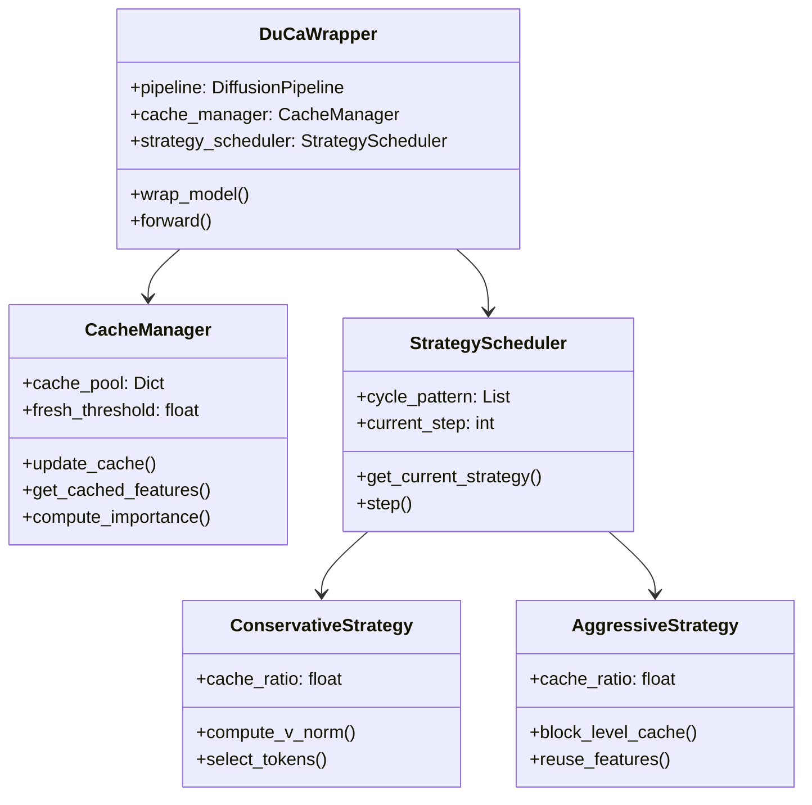
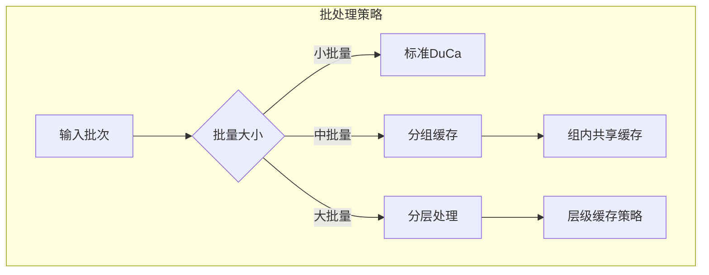

# DuCa实现与部署指南

## 快速开始

### 1. 环境配置

根据[官方安装指南](https://github.com/Shenyi-Z/DuCa)，首先配置环境：

```bash
# 基础依赖
pip install torch>=2.0.0 torchvision>=0.15.0
pip install transformers diffusers accelerate

# DuCa安装
git clone https://github.com/Shenyi-Z/DuCa.git
cd DuCa
pip install -e .

# FlashAttention（可选但推荐）
pip install flash-attn --no-build-isolation
```

### 2. 基本使用示例

根据[使用文档](https://github.com/Shenyi-Z/DuCa)：

```python
from duca import DuCaWrapper
from diffusers import PixArtAlphaPipeline
import torch

# 加载基础模型
pipe = PixArtAlphaPipeline.from_pretrained(
    "PixArt-alpha/PixArt-XL-2-1024-MS",
    torch_dtype=torch.float16
)

# 应用DuCa加速
pipe = DuCaWrapper(
    pipe,
    cache_config={
        'fresh_threshold': 0.7,
        'cache_ratio': 0.8,
        'cycle_pattern': [1, 1],  # [保守步数, 激进步数]
        'use_flash_attn': True
    }
)

# 生成图像
prompt = "A beautiful landscape with mountains and lake"
image = pipe(prompt).images[0]
```

## 核心实现细节

### 1. DuCa包装器架构



### 2. V-norm计算实现

根据[技术论文](https://arxiv.org/abs/2412.18911)的算法：

```python
def compute_v_norm_importance(self, value_states, cache_ratio):
    """
    V-norm based token importance scoring
    源自论文第3.2节的算法
    """
    batch_size, seq_len, num_heads, head_dim = value_states.shape

    # 计算每个token的V范数
    v_norms = torch.norm(
        value_states.reshape(batch_size, seq_len, -1),
        dim=-1
    )

    # 确定需要完整计算的token数量
    num_fresh = int(seq_len * (1 - cache_ratio))

    # 选择V范数最大的token
    important_indices = torch.topk(
        v_norms,
        k=num_fresh,
        dim=-1
    ).indices

    return important_indices
```

### 3. 双策略调度器

```python
class DualStrategyScheduler:
    """基于论文第4节的调度策略"""

    def __init__(self, cycle_pattern=[1, 1]):
        self.conservative_steps = cycle_pattern[0]
        self.aggressive_steps = cycle_pattern[1]
        self.cycle_length = sum(cycle_pattern)
        self.step_counter = 0

    def get_strategy(self, timestep):
        """确定当前时间步使用的策略"""
        position_in_cycle = self.step_counter % self.cycle_length

        if position_in_cycle < self.conservative_steps:
            return 'conservative'
        else:
            return 'aggressive'

    def step(self):
        self.step_counter += 1
```

## 模型适配指南

### 1. PixArt-α集成

根据[PixArt适配文档](https://github.com/Shenyi-Z/DuCa)：

```python
from duca.models import pixart

# 配置PixArt专用参数
pixart_config = {
    'model_type': 'pixart-alpha',
    'resolution': 1024,
    'cache_config': {
        'fresh_threshold': 0.75,
        'cache_ratio': 0.8,
        'cycle_pattern': [1, 1],
        'layer_wise_config': {
            # 不同层使用不同配置
            'early_layers': {'ratio': 0.9},
            'middle_layers': {'ratio': 0.8},
            'late_layers': {'ratio': 0.7}
        }
    }
}

model = pixart.create_duca_model(pixart_config)
```

### 2. OpenSora视频生成优化

```python
from duca.models import opensora

# OpenSora专用优化配置
opensora_config = {
    'model_type': 'opensora',
    'video_length': 16,  # 帧数
    'cache_config': {
        'fresh_threshold': 0.65,  # 视频可以更激进
        'cache_ratio': 0.85,
        'cycle_pattern': [1, 2],  # 更多激进步骤
        'temporal_consistency': True,  # 时序一致性
        'keyframe_interval': 4  # 关键帧间隔
    }
}

# 应用到视频生成
video_model = opensora.create_duca_model(opensora_config)
```

### 3. FLUX架构支持

根据[FLUX集成](https://duca2024.github.io/DuCa/)：

```python
from duca.models import flux

# FLUX特殊处理
flux_config = {
    'model_type': 'flux',
    'use_rope': True,  # Rotary Position Embedding
    'cache_config': {
        'fresh_threshold': 0.8,
        'cache_ratio': 0.75,
        'cycle_pattern': [2, 1],  # FLUX需要更保守
        'handle_rope': True  # 特殊处理位置编码
    }
}
```

### 4. 自定义模型适配

```python
class CustomModelAdapter:
    """为自定义扩散模型适配DuCa"""

    def __init__(self, model):
        self.model = model
        self.identify_attention_layers()

    def identify_attention_layers(self):
        """自动识别注意力层"""
        self.attention_layers = []
        for name, module in self.model.named_modules():
            if 'attention' in name.lower():
                self.attention_layers.append((name, module))

    def wrap_with_duca(self, config):
        """应用DuCa包装"""
        for name, layer in self.attention_layers:
            wrapped_layer = DuCaAttentionWrapper(
                layer,
                config
            )
            # 替换原始层
            parent, attr = self._get_parent_and_attr(name)
            setattr(parent, attr, wrapped_layer)
```

## 性能优化技巧

### 1. 内存优化

根据[优化指南](https://github.com/Shenyi-Z/DuCa)：

```python
# 内存优化配置
memory_optimized_config = {
    'cache_config': {
        'max_cache_size': 2048,  # 限制缓存大小
        'cache_dtype': torch.float16,  # 使用半精度
        'gradient_checkpointing': True,  # 梯度检查点
        'cpu_offload': False,  # 需要时启用
        'cache_cleanup_interval': 10  # 定期清理
    }
}

# 动态内存管理
class DynamicCacheManager:
    def manage_memory(self):
        if torch.cuda.memory_allocated() > threshold:
            self.reduce_cache_ratio()
            torch.cuda.empty_cache()
```

### 2. 批处理优化



```python
def optimized_batch_processing(batch_size):
    """根据批量大小优化策略"""
    if batch_size <= 4:
        return {
            'strategy': 'standard',
            'cache_ratio': 0.8
        }
    elif batch_size <= 16:
        return {
            'strategy': 'grouped',
            'group_size': 4,
            'shared_cache': True,
            'cache_ratio': 0.75
        }
    else:
        return {
            'strategy': 'hierarchical',
            'levels': 3,
            'cache_ratio': 0.7
        }
```

### 3. 多GPU并行

根据[分布式部署](https://github.com/Shenyi-Z/DuCa)：

```python
import torch.distributed as dist
from torch.nn.parallel import DistributedDataParallel

class DistributedDuCa:
    def __init__(self, model, world_size):
        self.model = DistributedDataParallel(model)
        self.world_size = world_size

    def setup_distributed_cache(self):
        """配置分布式缓存"""
        if dist.get_rank() == 0:
            # 主节点管理全局缓存策略
            self.global_cache_manager = GlobalCacheManager()

        # 每个GPU维护本地缓存
        self.local_cache = LocalCache(
            size=total_cache_size // self.world_size
        )

    def sync_cache_states(self):
        """同步缓存状态"""
        cache_tensors = self.local_cache.get_tensors()
        dist.all_reduce(cache_tensors)
```

## 部署最佳实践

### 1. 生产环境配置

```yaml
# production.yaml
deployment:
  environment: production
  monitoring: enabled
  logging_level: INFO

model:
  checkpoint: /models/pixart-xl-duca
  precision: fp16
  compile_mode: max-performance

duca:
  fresh_threshold: 0.75
  cache_ratio: 0.8
  cycle_pattern: [1, 1]
  use_flash_attn: true

  # 容错配置
  fallback:
    enabled: true
    quality_threshold: 0.95
    auto_adjust: true

  # 监控指标
  metrics:
    track_cache_hit_rate: true
    track_quality_scores: true
    alert_on_degradation: true
```

### 2. API服务器集成

```python
from fastapi import FastAPI
from duca import DuCaInferenceServer

app = FastAPI()
server = DuCaInferenceServer(config_path="production.yaml")

@app.post("/generate")
async def generate_image(prompt: str, params: dict):
    """生产级API端点"""
    try:
        # 应用DuCa加速
        result = await server.generate(
            prompt=prompt,
            **params
        )

        # 质量检查
        if result.quality_score < threshold:
            result = await server.generate_baseline(
                prompt=prompt,
                **params
            )

        return {
            "image": result.image,
            "metrics": {
                "generation_time": result.time,
                "cache_hit_rate": result.cache_stats
            }
        }
    except Exception as e:
        logger.error(f"Generation failed: {e}")
        return {"error": str(e)}
```

### 3. 监控与诊断

```python
class DuCaMonitor:
    """生产环境监控"""

    def __init__(self):
        self.metrics = {
            'cache_hit_rate': [],
            'generation_time': [],
            'quality_scores': [],
            'memory_usage': []
        }

    def log_metrics(self, stats):
        """记录关键指标"""
        self.metrics['cache_hit_rate'].append(
            stats['cache_hits'] / stats['total_accesses']
        )

        # 异常检测
        if self.detect_anomaly():
            self.alert_ops_team()

    def generate_report(self):
        """生成性能报告"""
        return {
            'avg_speedup': np.mean(self.metrics['generation_time']),
            'cache_efficiency': np.mean(self.metrics['cache_hit_rate']),
            'quality_maintained': self.check_quality_sla()
        }
```

## 故障排除

### 1. 常见问题

根据[FAQ文档](https://github.com/Shenyi-Z/DuCa)：

| 问题 | 原因 | 解决方案 |
|------|------|----------|
| 生成质量下降 | cache_ratio过高 | 降低到0.7-0.75 |
| 内存溢出 | 缓存累积 | 启用cache_cleanup |
| 速度提升不明显 | FlashAttention未启用 | 安装并启用flash-attn |
| 崩溃或不稳定 | 版本不兼容 | 检查依赖版本 |

### 2. 性能调试

```python
# 性能分析工具
from duca.profiler import DuCaProfiler

profiler = DuCaProfiler()
with profiler.profile():
    # 运行生成
    output = model.generate(prompt)

# 分析结果
stats = profiler.get_stats()
print(f"Cache命中率: {stats['cache_hit_rate']:.2%}")
print(f"实际加速比: {stats['speedup']:.2f}×")
print(f"瓶颈分析: {stats['bottlenecks']}")
```

## 参考资源

1. [DuCa GitHub Repository](https://github.com/Shenyi-Z/DuCa)
2. [官方文档](https://duca2024.github.io/DuCa/)
3. [arXiv论文](https://arxiv.org/abs/2412.18911)
4. [FlashAttention文档](https://github.com/Dao-AILab/flash-attention)
5. [Diffusers集成指南](https://huggingface.co/docs/diffusers)